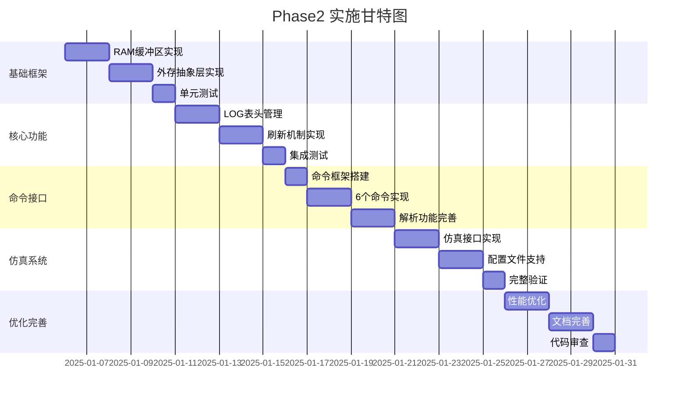

# LOG模块 Phase2 实施计划

## 1. 总体时间表



**预计总工期：5周（25个工作日）**

---

## 2. 详细任务分解

### Week 1: 基础框架（5天）

#### Day 1-2: RAM缓冲区实现

**任务清单：**
- [ ] 创建 `include/ww_log_ram.h` 头文件
  - [ ] 定义 `LOG_RAM_HEADER_T` 结构
  - [ ] 定义 `LOG_RAM_BUFFER_T` 结构
  - [ ] 声明RAM操作函数接口

- [ ] 创建 `core/ww_log_ram.c` 实现文件
  - [ ] 实现 `log_ram_init()` - 初始化RAM缓冲区
  - [ ] 实现 `log_ram_write()` - 写入LOG到RAM
  - [ ] 实现 `log_ram_need_flush()` - 检查是否需要刷新
  - [ ] 实现 `log_ram_get_usage()` - 获取使用量
  - [ ] 实现 `log_ram_read()` - 读取RAM数据
  - [ ] 实现 `log_ram_clear_flushed()` - 清理已刷新数据

- [ ] 定义DLM内存区域
  - [ ] 在 `include/ww_log_config.h` 中定义地址宏
  - [ ] 添加仿真模式的条件编译

**验收标准：**
- RAM缓冲区可以正常初始化
- 可以写入和读取LOG数据
- Ring Buffer翻转逻辑正确
- 阈值检测准确

#### Day 3-4: 外存抽象层实现

**任务清单：**
- [ ] 创建 `include/ww_log_storage.h` 头文件
  - [ ] 定义外存类型枚举
  - [ ] 定义分区表结构（简化版）
  - [ ] 声明统一读写接口

- [ ] 创建 `core/ww_log_storage.c` 实现文件
  - [ ] 实现 `log_storage_detect_type()` - 检测外存类型
  - [ ] 实现 `log_storage_get_log_partition()` - 获取LOG分区
  - [ ] 实现 `log_storage_check_partition_valid()` - 验证分区表
  - [ ] 实现 `log_storage_write()` - 统一写入接口
  - [ ] 实现 `log_storage_read()` - 统一读取接口
  - [ ] 实现 `log_storage_erase()` - 擦除接口（Flash）

- [ ] 创建仿真接口
  - [ ] 创建 `sim/sim_storage.h` 和 `sim/sim_storage.c`
  - [ ] 实现文件系统模拟EEPROM/Flash
  - [ ] 实现分区表加载（从JSON）

**验收标准：**
- 可以正确检测外存类型
- 可以读取分区表信息
- 统一接口可以操作EEPROM和Flash
- 仿真模式下可以使用文件模拟

#### Day 5: 单元测试

**任务清单：**
- [ ] 创建 `src/test/test_ram_buffer.c`
  - [ ] 测试RAM初始化
  - [ ] 测试基本读写
  - [ ] 测试Ring Buffer翻转
  - [ ] 测试阈值触发

- [ ] 创建 `src/test/test_storage.c`
  - [ ] 测试外存类型检测
  - [ ] 测试分区表解析
  - [ ] 测试EEPROM读写
  - [ ] 测试Flash擦除+写入

- [ ] 运行测试并修复问题

**验收标准：**
- 所有单元测试通过
- 代码覆盖率 > 80%

---

### Week 2: 核心功能（5天）

#### Day 1-2: LOG表头管理

**任务清单：**
- [ ] 创建 `include/ww_log_header.h` 头文件
  - [ ] 定义 `LOG_BLOCK_HEADER_T` 结构
  - [ ] 声明序列号管理函数

- [ ] 创建 `core/ww_log_header.c` 实现文件
  - [ ] 实现 `log_header_init()` - 初始化表头管理
  - [ ] 实现 `log_header_get_next_sequence()` - 获取下一个序列号
  - [ ] 实现 `log_header_scan_max_sequence()` - 扫描最大序列号
  - [ ] 实现 `log_header_build()` - 构建块表头
  - [ ] 实现 `log_header_validate()` - 验证表头有效性
  - [ ] 实现 `log_header_calc_checksum()` - 计算校验和

**验收标准：**
- 序列号可以正确递增
- 可以从外存恢复序列号
- 校验和计算正确

#### Day 3-4: 刷新机制实现

**任务清单：**
- [ ] 修改 `core/ww_log_encode.c`
  - [ ] 在 `ww_log_encode_output()` 中集成RAM写入
  - [ ] 添加阈值检查逻辑
  - [ ] 触发刷新时调用刷新函数

- [ ] 创建 `core/ww_log_flush.c` 实现文件
  - [ ] 实现 `log_flush_to_storage()` - 主刷新函数
  - [ ] 实现 `log_flush_prepare_data()` - 准备刷新数据
  - [ ] 实现 `log_flush_write_block()` - 写入一个块
  - [ ] 实现 `log_flush_cleanup()` - 清理RAM

- [ ] 添加手动触发接口
  - [ ] 实现 `log_manual_flush()` - 手动触发刷新

**验收标准：**
- RAM达到3KB时自动触发刷新
- 手动触发可以正常工作
- 刷新后RAM正确清理
- 数据完整写入外存

#### Day 5: 集成测试

**任务清单：**
- [ ] 创建 `src/test/test_flush_mechanism.c`
  - [ ] 测试自动刷新触发
  - [ ] 测试手动刷新
  - [ ] 测试连续刷新
  - [ ] 测试刷新失败处理

- [ ] 端到端测试
  - [ ] 写入LOG → RAM → 外存 → 读取验证

**验收标准：**
- 端到端流程正常工作
- 数据完整性验证通过

---

### Week 3: 命令接口（5天）

#### Day 1: 命令框架搭建

**任务清单：**
- [ ] 创建 `include/ww_log_cmd.h` 头文件
  - [ ] 定义命令处理函数类型
  - [ ] 定义命令表结构
  - [ ] 声明命令分发器

- [ ] 创建 `core/ww_log_cmd.c` 实现文件
  - [ ] 实现 `log_cmd_dispatch()` - 命令分发器
  - [ ] 实现 `log_cmd_parse_args()` - 参数解析
  - [ ] 实现命令表注册机制

**验收标准：**
- 命令分发器可以正确路由命令
- 参数解析正确

#### Day 2-3: 6个命令实现

**任务清单：**
- [ ] 实现 `log_cmd_ram_dump()`
  - [ ] 读取RAM中的LOG
  - [ ] 以HEX格式输出
  - [ ] 显示使用统计

- [ ] 实现 `log_cmd_ram_parse()`
  - [ ] 读取RAM中的LOG
  - [ ] 解码并格式化输出
  - [ ] 查找文件名映射

- [ ] 实现 `log_cmd_ram_flush()`
  - [ ] 手动触发刷新
  - [ ] 显示刷新结果

- [ ] 实现 `log_cmd_ext_dump()`
  - [ ] 从外存读取LOG块
  - [ ] 支持指定序列号
  - [ ] HEX格式输出

- [ ] 实现 `log_cmd_ext_parse()`
  - [ ] 从外存读取并解析
  - [ ] 支持指定序列号
  - [ ] 格式化输出

- [ ] 实现 `log_cmd_clear_all()`
  - [ ] 清空RAM
  - [ ] 擦除外存LOG分区
  - [ ] 重置序列号

**验收标准：**
- 所有命令可以正常执行
- 输出格式清晰易读
- 错误处理完善

#### Day 4-5: 解析功能完善

**任务清单：**
- [ ] 创建 `core/ww_log_parser.c`
  - [ ] 实现 `log_parse_entry()` - 解析单条LOG
  - [ ] 实现 `log_parse_buffer()` - 解析缓冲区
  - [ ] 实现 `log_get_file_name()` - 查找文件名
  - [ ] 实现 `log_get_level_str()` - 获取级别字符串

- [ ] 优化输出格式
  - [ ] 添加颜色支持（可选）
  - [ ] 添加时间戳显示
  - [ ] 添加统计信息

**验收标准：**
- 解析输出清晰易读
- 文件名映射正确
- 支持各种LOG格式

---

### Week 4: 仿真系统（5天）

#### Day 1-2: 仿真接口实现

**任务清单：**
- [ ] 创建 `sim/sim_hardware.h` 和 `sim/sim_hardware.c`
  - [ ] 实现RAM区域模拟
  - [ ] 实现寄存器模拟
  - [ ] 实现系统信息结构

- [ ] 完善 `sim/sim_storage.c`
  - [ ] 实现EEPROM文件操作
  - [ ] 实现Flash文件操作（含擦除检查）
  - [ ] 实现分区表文件加载

- [ ] 创建条件编译宏
  - [ ] 在所有相关文件中添加 `#ifdef SIMULATION_MODE`
  - [ ] 确保仿真和实际代码可以无缝切换

**验收标准：**
- 仿真模式可以正常编译运行
- 文件系统正确模拟外存行为
- 可以在PC上完整测试LOG功能

#### Day 3-4: 配置文件支持

**任务清单：**
- [ ] 创建 `sim/sim_config.json` 配置文件
  - [ ] 定义外存类型配置
  - [ ] 定义分区表配置
  - [ ] 定义存储文件路径

- [ ] 创建 `sim/sim_config.c` 配置加载器
  - [ ] 实现JSON解析（使用cJSON或自己实现）
  - [ ] 实现配置加载函数
  - [ ] 实现配置验证

- [ ] 创建仿真数据目录
  - [ ] 创建 `sim_data/` 目录
  - [ ] 生成初始的eeprom.bin和flash.bin文件

**验收标准：**
- 配置文件可以正确加载
- 可以通过配置切换EEPROM/Flash
- 仿真数据持久化正常

#### Day 5: 完整验证

**任务清单：**
- [ ] 创建完整的测试场景
  - [ ] 场景1：EEPROM模式完整流程
  - [ ] 场景2：Flash模式完整流程
  - [ ] 场景3：断电恢复测试
  - [ ] 场景4：循环覆盖测试

- [ ] 创建自动化测试脚本
  - [ ] 编写测试脚本（Python或Shell）
  - [ ] 自动执行所有测试场景
  - [ ] 生成测试报告

**验收标准：**
- 所有测试场景通过
- 仿真系统稳定可靠
- 可以作为开发和调试工具使用

---

### Week 5: 优化完善（5天）

#### Day 1-2: 性能优化

**任务清单：**
- [ ] 性能分析
  - [ ] 测量各函数执行时间
  - [ ] 识别性能瓶颈
  - [ ] 分析内存使用

- [ ] 优化关键路径
  - [ ] 优化RAM写入函数
  - [ ] 优化刷新触发检查
  - [ ] 减少不必要的内存拷贝

- [ ] 代码大小优化
  - [ ] 移除未使用的代码
  - [ ] 优化数据结构对齐
  - [ ] 使用编译器优化选项

**验收标准：**
- LOG写入时间 < 10μs
- 刷新触发检查 < 2μs
- 代码增量 < 5KB

#### Day 3-4: 文档完善

**任务清单：**
- [ ] 更新设计文档
  - [ ] 补充实际实现细节
  - [ ] 更新架构图
  - [ ] 添加实现注意事项

- [ ] 编写用户手册
  - [ ] Phase2功能使用指南
  - [ ] 命令行接口说明
  - [ ] 常见问题FAQ

- [ ] 编写开发文档
  - [ ] API参考手册
  - [ ] 移植指南
  - [ ] 调试技巧

- [ ] 代码注释完善
  - [ ] 所有公共函数添加Doxygen注释
  - [ ] 关键算法添加详细说明
  - [ ] 添加使用示例

**验收标准：**
- 文档完整清晰
- 新手可以根据文档快速上手
- API文档准确

#### Day 5: 代码审查

**任务清单：**
- [ ] 代码风格检查
  - [ ] 运行代码格式化工具
  - [ ] 检查命名规范
  - [ ] 检查注释完整性

- [ ] 代码质量检查
  - [ ] 运行静态分析工具
  - [ ] 检查内存泄漏
  - [ ] 检查边界条件处理

- [ ] 安全性检查
  - [ ] 检查缓冲区溢出风险
  - [ ] 检查整数溢出
  - [ ] 检查空指针解引用

- [ ] 最终测试
  - [ ] 运行完整测试套件
  - [ ] 压力测试
  - [ ] 长时间稳定性测试

**验收标准：**
- 无严重代码质量问题
- 所有测试通过
- 代码可以合并到主分支

---

## 3. 文件清单

### 新增头文件
```
include/
├── ww_log_ram.h          # RAM缓冲区管理
├── ww_log_storage.h      # 外存抽象层
├── ww_log_header.h       # LOG表头管理
├── ww_log_cmd.h          # 命令行接口
├── ww_log_parser.h       # LOG解析器
└── ww_log_config.h       # 配置定义（更新）
```

### 新增实现文件
```
core/
├── ww_log_ram.c          # RAM缓冲区实现
├── ww_log_storage.c      # 外存抽象层实现
├── ww_log_header.c       # LOG表头管理实现
├── ww_log_flush.c        # 刷新机制实现
├── ww_log_cmd.c          # 命令行接口实现
└── ww_log_parser.c       # LOG解析器实现
```

### 仿真系统文件
```
sim/
├── sim_hardware.h        # 硬件仿真头文件
├── sim_hardware.c        # 硬件仿真实现
├── sim_storage.h         # 存储仿真头文件
├── sim_storage.c         # 存储仿真实现
├── sim_config.h          # 配置加载头文件
├── sim_config.c          # 配置加载实现
├── sim_config.json       # 仿真配置文件
└── sim_data/             # 仿真数据目录├── eeprom.bin        # EEPROM模拟文件
    └── flash.bin         # Flash模拟文件
```

### 测试文件
```
src/test/
├── test_ram_buffer.c     # RAM缓冲区测试
├── test_storage.c        # 外存接口测试
├── test_flush_mechanism.c # 刷新机制测试
├── test_commands.c       # 命令接口测试
└── test_phase2_integration.c # Phase2集成测试
```

### 文档文件
```
doc/
├── Phase2_设计方案.md    # 设计方案（已创建）
├── Phase2_实施计划.md    # 实施计划（本文档）
├── Phase2_用户手册.md    # 用户手册
├── Phase2_API参考.md     # API参考
└── Phase2_移植指南.md    # 移植指南
```

---

## 4. 风险管理

### 4.1 技术风险

| 风险 | 可能性 | 影响 | 缓解措施 |
|------|--------|------|----------|
| Ring Buffer实现复杂度高 | 中 | 高 | 参考现有实现，充分测试边界条件 |
| 外存写入失败处理 | 中 | 高 | 实现重试机制，保留RAM数据 |
| 仿真系统与实际硬件差异 | 高 | 中 | 尽早在实际硬件上测试 |
| 性能不达标 | 低 | 中 | 提前进行性能测试，预留优化时间 |

### 4.2 进度风险

| 风险 | 可能性 | 影响 | 缓解措施 |
|------|--------|------|----------|
| 任务估时不准确 | 中 | 中 | 每周review进度，及时调整 |
| 依赖接口变更 | 低 | 高 | 尽早确认接口定义，冻结接口 |
| 测试发现重大问题 | 中 | 高 | 增量开发，持续测试 |

---

## 5. 质量保证

### 5.1 代码质量标准

- **代码覆盖率**：> 80%
- **静态分析**：无严重警告
- **内存泄漏**：零容忍
- **文档完整性**：所有公共API有文档

### 5.2 测试策略

1. **单元测试**：每个模块独立测试
2. **集成测试**：模块间交互测试
3. **系统测试**：端到端功能测试
4. **压力测试**：长时间运行测试
5. **回归测试**：确保不影响Phase1功能

### 5.3 Review检查点

- **Week 1结束**：基础框架代码review
- **Week 2结束**：核心功能代码review
- **Week 3结束**：命令接口代码review
- **Week 4结束**：仿真系统代码review
- **Week 5结束**：最终代码review

---

## 6. 交付物清单

### 6.1 代码交付物
- [ ] 所有源代码文件（.c/.h）
- [ ] 更新的Makefile
- [ ] 仿真系统完整代码
- [ ] 测试代码和测试数据

### 6.2 文档交付物
- [ ] Phase2设计方案
- [ ] Phase2实施计划
- [ ] Phase2用户手册
- [ ] Phase2 API参考
- [ ] Phase2移植指南
- [ ] 测试报告

### 6.3 配置交付物
- [ ] 仿真配置文件
- [ ] 编译配置说明
- [ ] 部署说明

---

## 7. 后续计划

### Phase3 可能的增强功能

1. **高级触发条件**
   - 定时触发（每N秒自动刷新）
   - ERROR级别立即触发
   - 系统事件触发（重启前等）

2. **多块存储**
   - 外存支持多个4KB块
   - 实现循环队列管理
   - 支持历史LOG查询

3. **压缩功能**
   - LOG数据压缩
   - 节省存储空间

4. **远程LOG**
   - 通过网络上传LOG
   - 远程LOG查看工具

5. **LOG分析工具**
   - PC端LOG分析软件
   - 统计分析功能
   - 可视化展示

---

## 8. 总结

Phase2的实施将为LOG模块增加完整的持久化存储能力，使其能够在嵌入式系统中可靠地记录和保存LOG数据。通过5周的开发，我们将交付一个功能完整、测试充分、文档齐全的LOG持久化系统。

关键成功因素：
1. 严格按照计划执行
2. 持续测试和集成
3. 及时发现和解决问题
4. 保持与Phase1的兼容性
5. 充分的文档和示例

---

**文档版本：v1.0**
**创建日期：2025-12-24**
**最后更新：2025-12-24**
