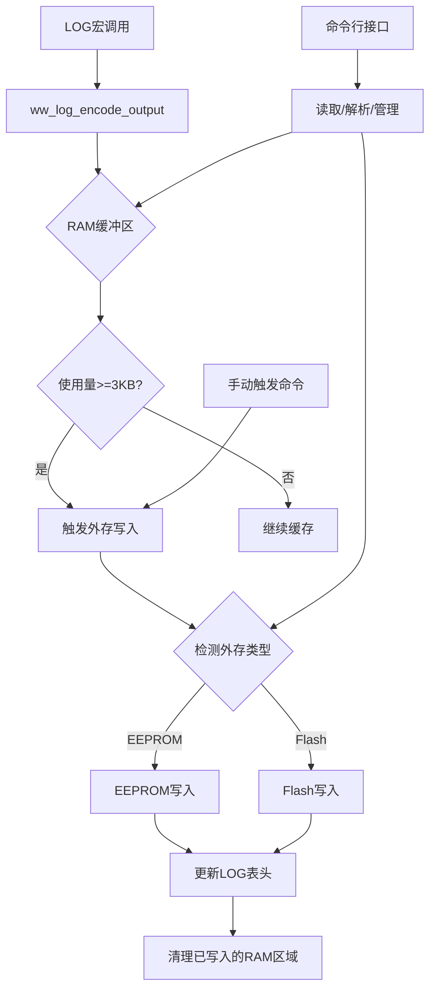
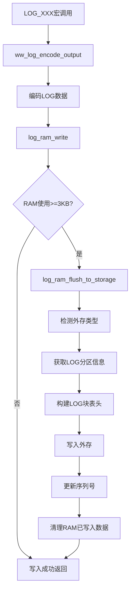
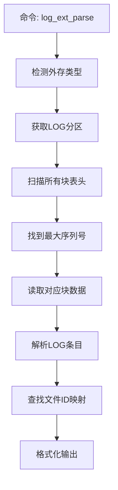
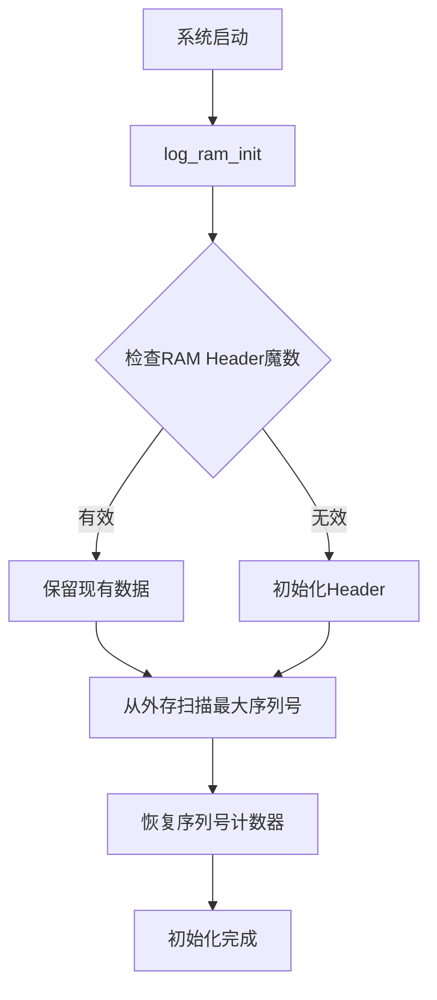

# LOG模块 Phase2 设计方案

## 文档版本控制

| 版本 | 日期 | 作者 | 修改说明 |
|------|------|------|----------|
| v1.0 | 2025-12-24 | Kilo Code | Phase2初始设计方案 |

---

## 1. Phase2 需求概述

### 1.1 核心需求

Phase2主要实现encode模式下的持久化存储功能：

1. **RAM缓冲区管理**
   - 使用服务器项目预留的4KB RAM空间
   - 实现Ring Buffer机制
   - 当RAM使用达到3KB时触发外存写入
   - 支持手动触发写入

2. **外存支持**
   - 支持EEPROM或Flash（互斥）
   - 自动检测外存类型
   - 实现LOG分区管理
   - 处理擦除和写入操作

3. **LOG表头设计**
   - 区分每一份LOG数据
   - 支持Ring Buffer翻转识别
   - 包含必要的元数据

4. **命令行接口**
   - 6个核心指令实现LOG的读取、解析、写入、清除等操作

5. **仿真系统**
   - 使用文件系统模拟外存
   - 模拟服务器项目的关键接口
   - 验证核心逻辑正确性

### 1.2 设计约束

- RAM空间：4KB（DLM_MAINTAIN_LOG区域）
- 外存LOG分区：4KB（可循环覆盖）
- 触发阈值：3KB
- 仿真方式：简化模拟（文件系统）

---

## 2. 系统架构设计

### 2.1 整体架构



### 2.2 模块划分

| 模块 | 文件 | 职责 |
|------|------|------|
| RAM缓冲区管理 | `ww_log_ram.c/h` | Ring Buffer实现、阈值检测 |
| 外存抽象层 | `ww_log_storage.c/h` | 外存类型检测、统一读写接口 |
| LOG表头管理 | `ww_log_header.c/h` | 表头格式定义、序列号管理 |
| 命令行接口 | `ww_log_cmd.c/h` | 6个命令的实现 |
| 仿真接口 | `sim/sim_storage.c/h` | 模拟外存、分区表等 |

---

## 3. RAM缓冲区详细设计

### 3.1 内存布局

```
DLM_MAINTAIN_LOG区域 (4KB = 4096 bytes)
┌─────────────────────────────────────────────────┐
│ LOG Header (64 bytes)│  元数据区
├─────────────────────────────────────────────────┤
│ Ring Buffer Data (4032 bytes)                   │  数据区
│ - 可存储约 1008 条LOG (每条4字节)                 │
│ - 或 504 条带1个参数的LOG (每条8字节)             │
└─────────────────────────────────────────────────┘

触发阈值：3KB = 3072 bytes
实际数据区使用达到 3008 bytes 时触发写入
```

### 3.2 数据结构定义

```c
/**
 * RAM LOG Header (64 bytes)
 * 位于DLM_MAINTAIN_LOG_BASE_ADDR
 */
typedef struct {
    U32 magic;              // 魔数: 0x574C4F47 ('WLOG')
    U32 version;            // 版本号: 0x00020000 (Phase2)
    U16 write_index;        // 写指针（字节偏移）
    U16 read_index;         // 读指针（字节偏移）
    U32 total_written;      // 累计写入字节数
    U32 flush_count;        // 刷新到外存次数
    U32 last_flush_time;    // 最后刷新时间戳（可选）
    U8  overflow_flag;      // 溢出标志
    U8  reserved[39];       // 保留字节U32 checksum;           // 校验和（前60字节）
} LOG_RAM_HEADER_T;

/**
 * Ring Buffer管理结构
 */
typedef struct {
    LOG_RAM_HEADER_T *header;   // 指向Header
    U8 *data;                   // 指向数据区
    U16 data_size;              // 数据区大小(4032)
    U16 threshold;              // 触发阈值(3008)
} LOG_RAM_BUFFER_T;
```

### 3.3 Ring Buffer操作

```c
/**
 * 初始化RAM缓冲区
 */
void log_ram_init(void);

/**
 * 写入LOG条目到RAM
 * @return 0=成功, -1=失败, 1=需要刷新
 */
int log_ram_write(U32 encoded, U32 *params, U8 param_count);

/**
 * 检查是否需要刷新到外存
 */
U8 log_ram_need_flush(void);

/**
 * 获取当前使用量（字节）
 */
U16 log_ram_get_usage(void);

/**
 * 读取RAM中的LOG数据
 */
int log_ram_read(U8 *buffer, U16 max_size, U16 *actual_size);

/**
 * 清空已刷新的数据
 */
void log_ram_clear_flushed(U16 size);
```

---

## 4. 外存管理详细设计

### 4.1 外存类型检测

```c
/**
 * 外存类型枚举
 */
typedef enum {
    EXT_MEM_NONE = 0,
    EXT_MEM_EEPROM = 1,
    EXT_MEM_FLASH = 2
} EXT_MEM_TYPE_E;

/**
 * 检测外存类型
 * 在实际项目中读取 REG_WW_STUS_SYS_INFO_U.sub.extMemType
 * 在仿真系统中通过配置文件指定
 */
EXT_MEM_TYPE_E log_storage_detect_type(void);
```

### 4.2 分区表管理

```c
/**
 * 分区表条目（简化版）
 */
typedef struct {
    U32 part_offset;        // 分区起始地址
    U32 part_size;          // 分区大小
    U8  part_type;          // 分区类型（LOG=0x05）
    U8  disk_type;          // 存储类型（EEPROM/FLASH）
} PART_ENTRY_T;

/**
 * 分区表结构（简化版）
 */
typedef struct {
    U32 magic;              // 魔数
    U16 entry_count;        // 条目数量
    PART_ENTRY_T entries[16]; // 最多16个分区
} PART_TABLE_T;

/**
 * 获取LOG分区信息
 * 模拟 pt_entry_get_by_key(pt, PART_ENTRY_TYPE_LOG, 0, 0)
 */
PART_ENTRY_T* log_storage_get_log_partition(void);

/**
 * 验证分区表有效性
 * 模拟 pt_table_check_valid()
 */
U8 log_storage_check_partition_valid(PART_TABLE_T *pt);
```

### 4.3 统一读写接口

```c
/**
 * 外存写入接口（统一）
 * @param offset 相对于LOG分区的偏移
 * @param data 数据指针
 * @param size 数据大小
 * @return 0=成功, <0=失败
 */
int log_storage_write(U32 offset, const U8 *data, U32 size);

/**
 * 外存读取接口（统一）
 */
int log_storage_read(U32 offset, U8 *data, U32 size);

/**
 * 擦除接口（Flash需要，EEPROM可为空操作）
 */
int log_storage_erase(U32 offset, U32 size);
```

---

## 5. LOG表头格式设计

### 5.1 外存LOG表头

每次从RAM刷新到外存时，都会写入一个表头：

```c
/**
 * 外存LOG块表头 (32 bytes)
 */
typedef struct {
    U32 magic;              // 魔数: 0x4C4F4748 ('LOGH')
    U32 sequence;           // 序列号（递增）
    U32 timestamp;          // 时间戳（可选）
    U16 data_size;          // 本块数据大小
    U16 entry_count;        // LOG条目数量
    U8  ram_overflow;       // RAM是否溢出
    U8  reserved[11];       // 保留
    U32 checksum;           // 校验和
} LOG_BLOCK_HEADER_T;
```

### 5.2 外存布局

```
LOG分区 (4KB)
┌─────────────────────────────────────────┐
│ Block 0: Header (32B) + Data (up to 4064B) │
├─────────────────────────────────────────┤
│ 当Block 0写满后，从头覆盖（循环）        │
└─────────────────────────────────────────┘

实际策略：
- 每次刷新写入一个完整的Block
- 如果数据>4064B，分多次刷新
- 使用sequence识别最新的LOG
```

### 5.3 序列号管理

```c
/**
 * 全局序列号（持久化在RAM Header中）
 */
static U32 g_log_sequence = 0;

/**
 * 获取下一个序列号
 */
U32 log_header_get_next_sequence(void);

/**
 * 从外存扫描最大序列号（启动时恢复）
 */
U32 log_header_scan_max_sequence(void);
```

---

## 6. 命令行接口设计

### 6.1 命令列表

| 命令 | 格式 | 功能 |
|------|------|------|
| log_ram_dump | `log_ram_dump` | 从RAM读取LOG并以HEX显示 |
| log_ram_parse | `log_ram_parse` | 从RAM读取LOG并解析显示 |
| log_ram_flush | `log_ram_flush` | 手动触发RAM到外存写入 |
| log_ext_dump | `log_ext_dump [seq]` | 从外存读取LOG（可指定序列号） |
| log_ext_parse | `log_ext_parse [seq]` | 从外存读取并解析LOG |
| log_clear_all | `log_clear_all` | 清除所有LOG（RAM+外存） |

### 6.2 命令实现框架

```c
/**
 * 命令处理函数类型
 */
typedef void (*LOG_CMD_HANDLER)(const char *args);

/**
 * 命令表条目
 */
typedef struct {
    const char *cmd_name;
    LOG_CMD_HANDLER handler;
    const char *help_text;
} LOG_CMD_ENTRY_T;

/**
 * 命令分发器
 */
void log_cmd_dispatch(const char *cmd_line);

/**
 * 各命令实现
 */
void log_cmd_ram_dump(const char *args);
void log_cmd_ram_parse(const char *args);
void log_cmd_ram_flush(const char *args);
void log_cmd_ext_dump(const char *args);
void log_cmd_ext_parse(const char *args);
void log_cmd_clear_all(const char *args);
```

### 6.3 输出格式示例

**log_ram_dump输出：**
```
=== RAM LOG DUMP ===
Usage: 1024/4032 bytes (25%)
Entries: ~256
---
0x00C80015 0x00000001
0x00C80023 0x00000002 0x00000003
...
```

**log_ram_parse输出：**
```
=== RAM LOG PARSED ===
[0000] [INF] demo_init.c:21 - Params: 0x00000001
[0001] [ERR] demo_init.c:35 - Params: 0x00000002 0x00000003
...
```

**log_ext_dump输出：**
```
=== EXTERNAL LOG DUMP ===
Storage: EEPROM
Partition: 0x1A00, Size: 4096 bytes
Latest Sequence: 5
---
Block #5 (1024 bytes, 256 entries):
0x00C80015 0x00000001
...
```

---

## 7. 仿真接口设计

### 7.1 仿真目标

在PC环境下模拟服务器项目的关键接口，验证LOG模块逻辑：

1. **RAM区域模拟**：使用静态数组或malloc
2. **外存模拟**：使用文件系统（eeprom.bin / flash.bin）
3. **分区表模拟**：使用JSON配置文件
4. **寄存器模拟**：使用全局变量

### 7.2 仿真接口实现

```c
/* ========== RAM模拟 ========== */
#ifdef SIMULATION_MODE
// 使用静态数组模拟DLM区域
static U8 g_sim_dlm_memory[4096];
#define DLM_MAINTAIN_LOG_BASE_ADDR  ((U32)g_sim_dlm_memory)
#define DLM_MAINTAIN_LOG_SIZE       4096
#else
// 实际硬件地址（由链接脚本定义）
extern U8 __dlm_log_start;
#define DLM_MAINTAIN_LOG_BASE_ADDR  ((U32)&__dlm_log_start)
#define DLM_MAINTAIN_LOG_SIZE       4096
#endif

/* ========== 外存类型寄存器模拟 ========== */
#ifdef SIMULATION_MODE
typedef struct {
    U8 extMemType;  // 0=None, 1=EEPROM, 2=Flash
} SIM_SYS_INFO_T;

extern SIM_SYS_INFO_T g_sim_sys_info;

#define REG_WW_STUS_SYS_INFO_U  g_sim_sys_info
#else
// 实际硬件寄存器
extern volatile SYS_INFO_REG_T REG_WW_STUS_SYS_INFO_U;
#endif

/* ========== 分区表接口模拟 ========== */
#ifdef SIMULATION_MODE
PART_TABLE_T* sim_pt_info_read(void);
PART_ENTRY_T* sim_pt_entry_get_by_key(PART_TABLE_T *pt, U8 type, U8 p1, U8 p2);
U8 sim_pt_table_check_valid(PART_TABLE_T *pt);

#define pt_info_read()  sim_pt_info_read()
#define pt_entry_get_by_key  sim_pt_entry_get_by_key
#define pt_table_check_valid  sim_pt_table_check_valid
#else
// 实际项目接口
#include "init_ex.h"
#include "apiredun_ex.h"
#endif

/* ========== 外存读写接口模拟 ========== */
#ifdef SIMULATION_MODE
int sim_eeprom_write(U32 offset, const U8 *data, U32 size);
int sim_eeprom_read(U32 offset, U8 *data, U32 size);
int sim_flash_write(U32 offset, const U8 *data, U32 size);
int sim_flash_read(U32 offset, U8 *data, U32 size);
int sim_flash_erase(U32 offset, U32 size);

#define svc_eeprom_acc_write  sim_eeprom_write
#define svc_eeprom_acc_read   sim_eeprom_read
#define svc_flash_acc_write   sim_flash_write
#define svc_flash_acc_read    sim_flash_read
#define svc_flash_acc_erase   sim_flash_erase
#else
// 实际项目接口
#include "svc_ex.h"
#endif
```

### 7.3 仿真配置文件

**sim_config.json:**
```json
{
  "system": {
    "ext_mem_type": "EEPROM",
    "comment": "EEPROM or FLASH"
  },
  "partition_table": {
    "magic": "0x50415254",
    "entries": [
      {
        "type": "LOG",
        "type_code": 5,
        "offset": "0x1A00",
        "size": "0x1000",
        "disk_type": "EEPROM"
      }
    ]
  },
  "storage_files": {
    "eeprom": "sim_data/eeprom.bin",
    "flash": "sim_data/flash.bin"
  }
}
```

### 7.4 仿真实现要点

1. **文件系统模拟外存**
   - 创建固定大小的二进制文件
   - 支持随机读写
   - Flash模拟：写入前检查是否已擦除（0xFF）

2. **分区表加载**
   - 启动时从JSON加载配置
   - 构建内存中的分区表结构

3. **简化的特性**
   - 不模拟读写延迟
   - 不模拟EEPROM写入次数限制
   - 不模拟Flash坏块管理

---

## 8. 实现流程设计

### 8.1 LOG写入流程



### 8.2 LOG读取流程



### 8.3 启动初始化流程



---

## 9. 关键算法设计

### 9.1 Ring Buffer写入算法

```c
int log_ram_write(U32 encoded, U32 *params, U8 param_count)
{
    LOG_RAM_BUFFER_T *buf = &g_log_ram_buffer;
    U16 write_idx = buf->header->write_index;
    U16 data_size = buf->data_size;
    U16 required = 4 + param_count * 4;  // 需要的字节数

    // 检查是否需要翻转
    if (write_idx + required > data_size) {
        // 标记溢出，从头开始写
        buf->header->overflow_flag = 1;
        write_idx = 0;
    }

    // 写入编码LOG*(U32*)(buf->data + write_idx) = encoded;
    write_idx += 4;

    // 写入参数
    for (U8 i = 0; i < param_count; i++) {
        *(U32*)(buf->data + write_idx) = params[i];
        write_idx += 4;
    }

    // 更新写指针
    buf->header->write_index = write_idx;
    buf->header->total_written += required;

    // 检查是否需要刷新
    if (write_idx >= buf->threshold) {
        return 1;  // 需要刷新
    }

    return 0;  // 成功
}
```

### 9.2 外存循环覆盖算法

```c
int log_storage_write_block(const U8 *data, U16 size)
{
    PART_ENTRY_T *part = log_storage_get_log_partition();
    U32 block_offset = 0;  // 简化：总是写到分区开头

    // 构建块表头
    LOG_BLOCK_HEADER_T header;
    header.magic = 0x4C4F4748;
    header.sequence = log_header_get_next_sequence();
    header.data_size = size;
    // ... 填充其他字段

    // Flash需要先擦除
    if (g_ext_mem_type == EXT_MEM_FLASH) {
        log_storage_erase(block_offset, 4096);
    }

    // 写入表头
    log_storage_write(block_offset, (U8*)&header, sizeof(header));

    // 写入数据
    log_storage_write(block_offset + sizeof(header), data, size);

    return 0;
}
```

### 9.3 LOG解析算法

```c
void log_parse_entry(U32 encoded, U32 *params, U8 param_count)
{
    // 解码
    U16 log_id = (encoded >> 20) & 0xFFF;
    U16 line = (encoded >> 8) & 0xFFF;
    U8 level = encoded & 0x3;

    // 查找文件名
    U8 module_id = log_id >> 6;
    const char *file_name = log_get_file_name(log_id);
    const char *level_str = log_get_level_str(level);

    // 输出
    printf("[%s] %s:%d", level_str, file_name, line);

    if (param_count > 0) {
        printf(" - Params:");
        for (U8 i = 0; i < param_count; i++) {
            printf(" 0x%08X", params[i]);
        }
    }
    printf("\n");
}
```

---

## 10. 错误处理设计

### 10.1 错误码定义

```c
typedef enum {
    LOG_ERR_OK = 0,
    LOG_ERR_NO_SPACE = -1,
    LOG_ERR_INVALID_PARAM = -2,
    LOG_ERR_STORAGE_FAIL = -3,
    LOG_ERR_NO_PARTITION = -4,
    LOG_ERR_CHECKSUM_FAIL = -5,
    LOG_ERR_NOT_INITIALIZED = -6
} LOG_ERROR_CODE_E;
```

### 10.2 异常场景处理

| 场景 | 处理策略 |
|------|----------|
| RAM写满但外存不可用 | 丢弃最老的LOG，继续写入新LOG |
| 外存写入失败 | 重试3次，失败后标记错误但不阻塞 |
| 分区表损坏 | 使用默认分区配置 |
| 校验和错误 | 跳过该块，继续读取下一块 |
| 序列号翻转 | 使用32位序列号，足够长时间不翻转 |

---

## 11. 性能评估

### 11.1 内存占用

| 项目 | 大小 | 说明 |
|------|------|------|
| RAM缓冲区 | 4KB | 固定分配（DLM区域） |
| 全局变量 | ~200B | 管理结构、状态变量 |
| 栈开销 | ~100B | 函数调用栈 |
| **总计** | **~4.3KB** | |

### 11.2 时间开销

| 操作 | 时间 | 说明 |
|------|------|------|
| RAM写入 | ~5μs | 内存拷贝 |
| 阈值检查 | ~1μs | 简单比较 |
| 外存写入（EEPROM） | ~5ms | 硬件限制 |
| 外存写入（Flash） | ~20ms | 包含擦除时间 |
| LOG解析 | ~50μs/条 | 查表+格式化 |

### 11.3 外存寿命

- **EEPROM**：100万次写入，按每天刷新100次，可用27年
- **Flash**：10万次擦除，按每天擦除10次，可用27年

---

## 12. 测试计划

### 12.1 单元测试

1. **RAM缓冲区测试**
   - Ring Buffer基本读写
   - 翻转场景
   - 阈值触发

2. **外存接口测试**
   - EEPROM读写
   - Flash擦除+写入
   - 分区表解析

3. **LOG表头测试**
   - 序列号递增
   - 校验和计算
   - 损坏检测

### 12.2 集成测试

1. **端到端流程**
   - LOG写入→RAM→外存→读取→解析

2. **压力测试**
   - 连续写入10000条LOG
   - 验证数据完整性

3. **异常测试**
   - 外存不可用
   - 分区表损坏
   - 断电恢复

### 12.3 仿真验证

1. **仿真环境搭建**
   - 配置文件加载
   - 文件系统初始化

2. **功能验证**
   - 所有命令执行
   - 数据持久化

3. **兼容性验证**
   - 与Phase1的兼容性
   - 不同配置下的行为

---

## 13. 实施计划

### 13.1 开发阶段

```
Week 1: 基础框架
├─ Day 1-2: RAM缓冲区实现
├─ Day 3-4: 外存抽象层
└─ Day 5: 单元测试

Week 2: 核心功能
├─ Day 1-2: LOG表头管理
├─ Day 3-4: 刷新机制
└─ Day 5: 集成测试

Week 3: 命令接口
├─ Day 1-2: 6个命令实现
├─ Day 3-4: 解析功能
└─ Day 5: 功能测试

Week 4: 仿真系统
├─ Day 1-2: 仿真接口实现
├─ Day 3-4: 配置文件支持
└─ Day 5: 完整验证

Week 5: 优化完善
├─ Day 1-2: 性能优化
├─ Day 3-4: 文档完善
└─ Day 5: 代码审查
```

### 13.2 里程碑

| 里程碑 | 时间 | 验收标准 |
|--------|------|----------|
| M1: RAM缓冲区完成 | Week 1 | Ring Buffer正常工作，
