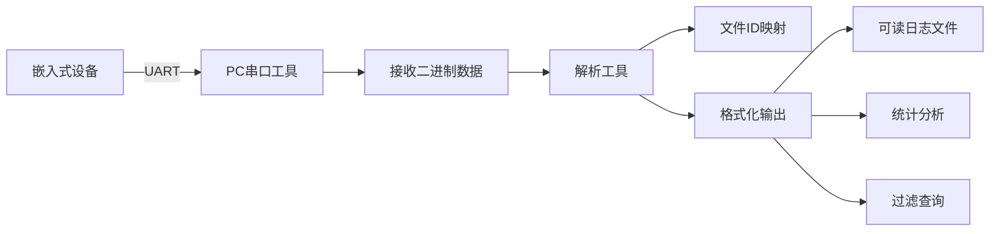

# WW_LOG Phase2 设计方案

## 文档信息
- **版本**: v1.0
- **日期**: 2025-12-10
- **作者**: Architect Mode
- **状态**: 设计阶段

---

## 1. Phase2 目标概述

### 1.1 Phase1 完成情况回顾
Phase1已经完成:
- ✅ 三种模式的准确输出 (STR/ENCODE/DISABLED)
- ✅ 编译时和运行时开关功能
- ✅ 模块级别的动态控制
- ✅ 基础的encode模式实现

### 1.2 Phase2 核心目标
1. **多输出目标支持**: 支持同时输出到RAM和UART,可配置
2. **RAM缓冲区管理**: 实现环形缓冲区,支持buffer满时自动翻转
3. **热重启功能**: 重启后保留上一次的日志,不被刷掉
4. **日志读取优化**: 批量读取二进制数据,PC端工具解析

### 1.3 设计原则
- **可配置性**: 通过宏定义灵活配置各项功能
- **高效性**: 最小化临界区时间,减少性能影响
- **可靠性**: ERROR日志优先保护,防止重要信息丢失
- **易用性**: 提供简洁的API和命令行接口

---

## 2. RAM缓冲区设计

### 2.1 数据结构设计

```c
/**
 * 单条日志条目结构
 *
 * 说明:
 * - 每条日志包含1个编码头 + 最多16个参数
 * - 编码头包含: log_id, line, level, data_len
 * - 参数为32位整数,可以是任意数据
 */
typedef struct {
    U32 encoded_header;     // 编码的头部信息
    U8  param_count;        // 实际参数个数 (0-16)
    U8  flags;              // 标志位: bit0=已读, bit1=ERROR级别
    U16 reserved;           // 保留,用于对齐
    U32 params[16];         // 参数数组 (最多16个)
} WW_LOG_ENTRY_T;

/**
 * RAM缓冲区管理结构
 *
 * 说明:
 * - 使用环形缓冲区管理
 * - 支持热重启保留(通过魔数校验)
 * - 统计信息用于监控和调试
 */
typedef struct {
    U32 magic_head;                // 魔数头: 0x574C4F47 ('WLOG')
    U16 head;// 读指针(最老的日志)
    U16 tail;                                    // 写指针(下一条写入位置)
    U32 write_count;                             // 累计写入计数
    U32 read_count;                              // 累计读取计数
    U32 overflow_count;                          // 溢出计数(丢弃的日志数)
    U32 error_protected_count;                   // ERROR日志保护计数
    U16 entry_size;                              // 缓冲区大小
    U16 reserved;                                // 保留
    WW_LOG_ENTRY_T entries[WW_LOG_RAM_BUFFER_SIZE];  // 日志条目数组
    U32 magic_tail;                              // 魔数尾: 0x574C4F47
} WW_LOG_RAM_BUFFER_T;

/**
 * 标志位定义
 */
#define WW_LOG_FLAG_READ        0x01    // 已读标志
#define WW_LOG_FLAG_ERROR       0x02    // ERROR级别标志
#define WW_LOG_FLAG_PROTECTED   0x04    // 受保护标志(不可覆盖)
```

### 2.2 内存布局

```
RAM缓冲区内存布局:
┌─────────────────────────────────────────────────────────┐
│ magic_head (4B)                                         │
├─────────────────────────────────────────────────────────┤
│ head (2B) | tail (2B)│
├─────────────────────────────────────────────────────────┤
│ write_count (4B)                                        │
├─────────────────────────────────────────────────────────┤
│ read_count (4B)                                         │
├─────────────────────────────────────────────────────────┤
│ overflow_count (4B)                                     │
├─────────────────────────────────────────────────────────┤
│ error_protected_count (4B)                              │
├─────────────────────────────────────────────────────────┤
│ entry_size (2B) | reserved (2B)                         │
├─────────────────────────────────────────────────────────┤
│ Entry[0]: encoded_header + param_count + flags + params │
├─────────────────────────────────────────────────────────┤
│ Entry[1]: ...                                           │
├─────────────────────────────────────────────────────────┤
│ ...                                                     │
├─────────────────────────────────────────────────────────┤
│ Entry[N-1]: ...                                         │
├─────────────────────────────────────────────────────────┤
│ magic_tail (4B)                                         │
└─────────────────────────────────────────────────────────┘

总大小 = 32 + N * sizeof(WW_LOG_ENTRY_T)
       = 32 + N * (4 + 1 + 1 + 2 + 16*4)
       = 32 + N * 72 字节

默认N=128: 32 + 128*72 = 9248 字节 ≈ 9KB
```

### 2.3 环形缓冲区工作原理

```
初始状态 (空):
  head=0, tail=0┌───┬───┬───┬───┬───┬───┬───┬───┐
  │   │   │   │   │   │   │   │   │
  └───┴───┴───┴───┴───┴───┴───┴───┘↑
  H/T

写入3条后:
  head=0, tail=3
  ┌───┬───┬───┬───┬───┬───┬───┬───┐
  │ 1 │ 2 │ 3 │   │   │   │   │   │
  └───┴───┴───┴───┴───┴───┴───┴───┘
   ↑           H           T

读取1条后:
  head=1, tail=3
  ┌───┬───┬───┬───┬───┬───┬───┬───┐
  │ R │ 2 │ 3 │   │   │   │   │   │
  └───┴───┴───┴───┴───┴───┴───┴───┘
       ↑       ↑
       H       T

写满后继续写(翻转):
  head=1, tail=0 (tail追上head-1表示满)
  ┌───┬───┬───┬───┬───┬───┬───┬───┐
  │ 8 │ 2 │ 3 │ 4 │ 5 │ 6 │ 7 │ X │
  └───┴───┴───┴───┴───┴───┴───┴───┘
   ↑       ↑
   T       H

说明:
- R = 已读
- X = 被覆盖(如果不是ERROR或已读)
- 数字 = 日志序号
```

---

## 3. 热重启保留机制

### 3.1 设计思路

使用链接脚本将RAM缓冲区放置在特殊的`.noinit`段,该段在热重启时不会被清零。通过魔数校验判断是冷启动还是热重启。

### 3.2 链接脚本配置

```ld
/* 在链接脚本中添加 .noinit 段 */
MEMORY
{
    FLASH (rx)  : ORIGIN = 0x08000000, LENGTH = 256K
    RAM (rwx)   : ORIGIN = 0x20000000, LENGTH = 60K
    NOINIT (rw) : ORIGIN = 0x2000F000, LENGTH = 4K  /* 预留4K用于noinit */
}

SECTIONS
{
    /* 其他段定义... */

    /* 不初始化段 - 热重启保留 */
    .noinit (NOLOAD) :
    {
        . = ALIGN(4);
        _noinit_start = .;
        *(.noinit)
        *(.noinit.*)
        . = ALIGN(4);
        _noinit_end = .;
    } > NOINIT
}
```

### 3.3 缓冲区声明

```c
/**
 * 全局RAM缓冲区
 * 使用 __attribute__((section(".noinit"))) 放到特殊段
 */
#ifdef WW_LOG_RAM_PERSISTENT
__attribute__((section(".noinit")))
static WW_LOG_RAM_BUFFER_T g_ww_log_ram_buffer;
#else
static WW_LOG_RAM_BUFFER_T g_ww_log_ram_buffer;
#endif
```

### 3.4 初始化逻辑

```c
/**
 * RAM缓冲区初始化
 *
 * @param force_clear  强制清空: 1=清空, 0=尝试保留
 *
 * 返回值:
 *   0 = 冷启动(已清空)
 *   1 = 热重启(保留了日志)
 */
int ww_log_ram_init(U8 force_clear)
{
    U8 warm_restart = 0;

#ifdef WW_LOG_RAM_PERSISTENT
    // 检查魔数
    if (!force_clear &&
        g_ww_log_ram_buffer.magic_head == WW_LOG_RAM_MAGIC &&
        g_ww_log_ram_buffer.magic_tail == WW_LOG_RAM_MAGIC) {

        // 进一步检查数据一致性
        if (g_ww_log_ram_buffer.head < g_ww_log_ram_buffer.entry_size &&
            g_ww_log_ram_buffer.tail < g_ww_log_ram_buffer.entry_size &&
            g_ww_log_ram_buffer.entry_size == WW_LOG_RAM_BUFFER_SIZE) {

            warm_restart = 1;
            printf("LOG: Warm restart - %u logs preserved\n",
                   ww_log_ram_get_count());
        }
    }
#endif

    if (!warm_restart) {
        // 冷启动或数据损坏,初始化缓冲区
        memset(&g_ww_log_ram_buffer, 0, sizeof(g_ww_log_ram_buffer));
        g_ww_log_ram_buffer.magic_head = WW_LOG_RAM_MAGIC;
        g_ww_log_ram_buffer.magic_tail = WW_LOG_RAM_MAGIC;
        g_ww_log_ram_buffer.entry_size = WW_LOG_RAM_BUFFER_SIZE;
        printf("LOG: Cold start - RAM buffer initialized\n");
    }

    return warm_restart;
}
```

---

## 4. 输出目标配置系统

### 4.1 配置宏定义

```c
/* ww_log_config.h */

/**
 * 输出目标配置
 * 可以同时启用多个输出目标
 */
#define WW_LOG_OUTPUT_UART_EN       1    // 启用UART输出
#define WW_LOG_OUTPUT_RAM_EN        1    // 启用RAM缓冲
// #define WW_LOG_OUTPUT_FLASH_EN   0    // Flash输出(Phase3)

/**
 * RAM缓冲区配置
 */
#define WW_LOG_RAM_BUFFER_SIZE      128  // 缓冲区条目数
#define WW_LOG_RAM_PERSISTENT       1    // 热重启保留

/**
 * ERROR日志保护策略
 */
#define WW_LOG_ERROR_PROTECT_EN     1    // 启用ERROR保护
#define WW_LOG_ERROR_MAX_UNREAD     32   // 最多保留32条未读ERROR
```

### 4.2 输出函数重构

```c
/**
 * 核心输出函数 - 支持多输出目标
 */
void ww_log_encode_output(U16 log_id, U16 line, U8 level,
                          U8 param_count, ...)
{
    U32 encoded_header;
    U32 params[16];
    va_list args;
    int i;

    // 1. 模块过滤
    U8 module_id = WW_LOG_GET_MODULE_ID(log_id);
    if (!ww_log_is_module_enabled(module_id)) {
        return;
    }

    // 2. 级别过滤
    if (level > g_ww_log_level_threshold) {
        return;
    }

    // 3. 编码头部
    encoded_header = WW_LOG_ENCODE(log_id, line, param_count, level);

    // 4. 提取参数
    va_start(args, param_count);
    for (i = 0; i < param_count && i < 16; i++) {
        params[i] = va_arg(args, U32);
    }
    va_end(args);

    // 5. 输出到各个目标
#ifdef WW_LOG_OUTPUT_UART_EN
    ww_log_output_uart(encoded_header, params, param_count);
#endif

#ifdef WW_LOG_OUTPUT_RAM_EN
    ww_log_output_ram(encoded_header, params, param_count, level);
#endif
}
```

### 4.3 UART输出实现

```c
/**
 * UART输出函数
 * 格式: [编码头] [参数1] [参数2] ... \n
 */
static void ww_log_output_uart(U32 encoded_header, U32 *params, U8 count)
{
    printf("LOG:%08X", encoded_header);

    for (int i = 0; i < count; i++) {
        printf(",%08X", params[i]);
    }

    printf("\n");
}
```

---

## 5. 环形缓冲区管理算法

### 5.1 核心函数设计

#### 5.1.1 写入函数

```c
/**
 * 向RAM缓冲区写入日志
 *
 * @param encoded_header  编码的头部
 * @param params          参数数组
 * @param param_count     参数个数
 * @param level           日志级别
 *
 * @return 0=成功, -1=失败
 */
int ww_log_output_ram(U32 encoded_header, U32 *params,
                      U8 param_count, U8 level)
{
    WW_LOG_ENTRY_T *entry;
    U16 next_tail;
    U8 is_error = (level == WW_LOG_LEVEL_ERR);

    // 进入临界区
    ENTER_CRITICAL_SECTION();

    // 检查是否满
    next_tail = (g_ww_log_ram_buffer.tail + 1) %
                g_ww_log_ram_buffer.entry_size;

    if (next_tail == g_ww_log_ram_buffer.head) {
        // 缓冲区满,需要覆盖
        if (!ww_log_can_overwrite(g_ww_log_ram_buffer.head, is_error)) {
            // 不能覆盖,丢弃新日志
            g_ww_log_ram_buffer.overflow_count++;
            EXIT_CRITICAL_SECTION();
            return -1;
        }

        // 可以覆盖,head前移
        g_ww_log_ram_buffer.head =
            (g_ww_log_ram_buffer.head + 1) %
            g_ww_log_ram_buffer.entry_size;
        g_ww_log_ram_buffer.overflow_count++;
    }

    // 写入数据
    entry = &g_ww_log_ram_buffer.entries[g_ww_log_ram_buffer.tail];
    entry->encoded_header = encoded_header;
    entry->param_count = param_count;
    entry->flags = 0;

    if (is_error) {
        entry->flags |= WW_LOG_FLAG_ERROR;
    }

    // 复制参数
    for (int i = 0; i < param_count && i < 16; i++) {
        entry->params[i] = params[i];
    }

    // 更新tail
    g_ww_log_ram_buffer.tail = next_tail;
    g_ww_log_ram_buffer.write_count++;

    EXIT_CRITICAL_SECTION();

    return 0;
}
```

#### 5.1.2 覆盖策略

```c
/**
 * 判断是否可以覆盖指定位置的日志
 *
 * @param index     要检查的索引
 * @param is_error  当前要写入的是否为ERROR
 *
 * @return 1=可以覆盖, 0=不可覆盖
 */
static U8 ww_log_can_overwrite(U16 index, U8 is_error)
{
    WW_LOG_ENTRY_T *entry = &g_ww_log_ram_buffer.entries[index];

#ifdef WW_LOG_ERROR_PROTECT_EN
    // ERROR日志保护策略
    if (entry->flags & WW_LOG_FLAG_ERROR) {
        // 如果是未读的ERROR,不能覆盖
        if (!(entry->flags & WW_LOG_FLAG_READ)) {
            // 统计未读ERROR数量
            U16 unread_errors = ww_log_count_unread_errors();
            // 如果未读ERROR超过阈值,允许覆盖最老的
            if (unread_errors >= WW_LOG_ERROR_MAX_UNREAD) {
                g_ww_log_ram_buffer.error_protected_count++;
                return 1;
            }

            return 0;  // 不能覆盖
        }
    }
#endif

    // 非ERROR或已读,可以覆盖
    return 1;
}
```

#### 5.1.3 读取函数

```c
/**
 * 从RAM缓冲区读取一条日志
 *
 * @param entry  输出参数,保存读取的日志
 *
 * @return 0=成功, -1=缓冲区为空
 */
int ww_log_ram_read_entry(WW_LOG_ENTRY_T *entry)
{
    if (entry == NULL) {
        return -1;
    }

    ENTER_CRITICAL_SECTION();

    // 检查是否为空
    if (g_ww_log_ram_buffer.head == g_ww_log_ram_buffer.tail) {
        EXIT_CRITICAL_SECTION();
        return -1;
    }

    // 复制数据
    memcpy(entry,
           &g_ww_log_ram_buffer.entries[g_ww_log_ram_buffer.head],
           sizeof(WW_LOG_ENTRY_T));

    // 标记为已读
    g_ww_log_ram_buffer.entries[g_ww_log_ram_buffer.head].flags |=
        WW_LOG_FLAG_READ;

    // head前移
    g_ww_log_ram_buffer.head =
        (g_ww_log_ram_buffer.head + 1) %
        g_ww_log_ram_buffer.entry_size;

    g_ww_log_ram_buffer.read_count++;

    EXIT_CRITICAL_SECTION();

    return 0;
}
```

#### 5.1.4 批量读取函数

```c
/**
 * 批量读取日志(用于导出)
 *
 * @param buffer     输出缓冲区
 * @param max_count  最多读取的条目数
 *
 * @return 实际读取的条目数
 */
int ww_log_ram_read_batch(WW_LOG_ENTRY_T *buffer, U16 max_count)
{
    U16 count = 0;

    if (buffer == NULL || max_count == 0) {
        return 0;
    }

    while (count < max_count) {
        if (ww_log_ram_read_entry(&buffer[count]) != 0) {
            break;  // 缓冲区已空
        }
        count++;
    }

    return count;
}
```

---

## 6. 日志读取API接口

### 6.1 统计信息API

```c
/**
 * 日志缓冲区统计信息
 */
typedef struct {
    U16 total_size;         // 缓冲区总大小
    U16 used_count;         // 当前使用的条目数
    U32 write_count;        // 累计写入次数
    U32 read_count;         // 累计读取次数
    U32 overflow_count;     // 溢出次数
    U32 error_protected;    // ERROR保护次数
} WW_LOG_RAM_INFO_T;

/**
 * 获取RAM缓冲区统计信息
 */
void ww_log_ram_get_info(WW_LOG_RAM_INFO_T *info)
{
    if (info == NULL) {
        return;
    }
    ENTER_CRITICAL_SECTION();

    info->total_size = g_ww_log_ram_buffer.entry_size;
    info->used_count = ww_log_ram_get_count();
    info->write_count = g_ww_log_ram_buffer.write_count;
    info->read_count = g_ww_log_ram_buffer.read_count;
    info->overflow_count = g_ww_log_ram_buffer.overflow_count;
    info->error_protected = g_ww_log_ram_buffer.error_protected_count;

    EXIT_CRITICAL_SECTION();
}
```

### 6.2 导出API

```c
/**
 * 导出所有日志到缓冲区(不删除)
 *
 * @param buffer     输出缓冲区
 * @param max_count  缓冲区大小
 *
 * @return 实际导出的条目数
 */
int ww_log_ram_export(WW_LOG_ENTRY_T *buffer, U16 max_count)
{
    U16 count = 0;
    U16 index;

    if (buffer == NULL || max_count == 0) {
        return 0;
    }

    ENTER_CRITICAL_SECTION();

    index = g_ww_log_ram_buffer.head;

    while (index != g_ww_log_ram_buffer.tail && count < max_count) {
        memcpy(&buffer[count],
               &g_ww_log_ram_buffer.entries[index],
               sizeof(WW_LOG_ENTRY_T));

        index = (index + 1) % g_ww_log_ram_buffer.entry_size;
        count++;
    }

    EXIT_CRITICAL_SECTION();

    return count;
}
```

### 6.3 清空API

```c
/**
 * 清空RAM缓冲区
 */
void ww_log_ram_clear(void)
{
    ENTER_CRITICAL_SECTION();

    g_ww_log_ram_buffer.head = 0;
    g_ww_log_ram_buffer.tail = 0;

    // 可选: 清空所有条目
    memset(g_ww_log_ram_buffer.entries, 0,
           sizeof(WW_LOG_ENTRY_T) * g_ww_log_ram_buffer.entry_size);

    EXIT_CRITICAL_SECTION();
}
```

---

## 7. UART命令行接口

### 7.1 命令定义

```c
/**
 * 支持的命令:
 * - log info          : 显示缓冲区统计信息
 * - log read <n>      : 读取n条日志
 * - log export        : 导出所有日志
 * - log clear         : 清空缓冲区
 * - log dump          : 以十六进制格式dump所有日志
 */
```

### 7.2 命令处理函数

```c
/**
 * 命令行处理函数
 */
void ww_log_cmd_handler(const char *cmd)
{
    if (strncmp(cmd, "log info", 8) == 0) {
        ww_log_cmd_info();
    }
    else if (strncmp(cmd, "log read", 8) == 0) {
        int n = atoi(cmd + 9);
        ww_log_cmd_read(n);
    }
    else if (strncmp(cmd, "log export", 10) == 0) {
        ww_log_cmd_export();
    }
    else if (strncmp(cmd, "log clear", 9) == 0) {
        ww_log_cmd_clear();
    }
    else if (strncmp(cmd, "log dump", 8) == 0) {
        ww_log_cmd_dump();
    }
    else {
        printf("Unknown log command\n");
        printf("Usage:\n");
        printf("  log info          - Show buffer statistics\n");
        printf("  log read <n>      - Read n log entries\n");
        printf("  log export        - Export all logs\n");
        printf("  log clear         - Clear buffer\n");
        printf("  log dump          - Dump all logs in hex\n");
    }
}
```

### 7.3 命令实现

```c
/**
 * info命令: 显示统计信息
 */
static void ww_log_cmd_info(void)
{
    WW_LOG_RAM_INFO_T info;

    ww_log_ram_get_info(&info);

    printf("\n=== Log Buffer Info ===\n");
    printf("Total Size    : %u\n", info.total_size);
    printf("Used Count    : %u\n", info.used_count);
    printf("Write Count   : %u\n", info.write_count);
    printf("Read Count    : %u\n", info.read_count);
    printf("Overflow Count: %u\n", info.overflow_count);
    printf("Error Protected: %u\n", info.error_protected);
    printf("=======================\n\n");
}

/**
 * read命令: 读取n条日志
 */
static void ww_log_cmd_read(int n)
{
    WW_LOG_ENTRY_T entry;
    int count = 0;

    if (n <= 0 || n > 100) {
        printf("Invalid count (1-100)\n");
        return;
    }

    printf("\n=== Reading %d logs ===\n", n);

    while (count < n) {
        if (ww_log_ram_read_entry(&entry) != 0) {
            break;  // 缓冲区已空
        }

        // 输出格式: [序号] 编码头 参数1 参数2 ...
        printf("[%03d] %08X", count, entry.encoded_header);

        for (int i = 0; i < entry.param_count; i++) {
            printf(" %08X", entry.params[i]);
        }

        printf("\n");
        count++;
    }

    printf("=== Read %d logs ===\n\n", count);
}

/**
 * export命令: 导出所有日志(不删除)
 */
static void ww_log_cmd_export(void)
{
    WW_LOG_ENTRY_T buffer[128];  // 临时缓冲区
    int count;

    count = ww_log_ram_export(buffer, 128);

    printf("\n=== Exporting %d logs ===\n", count);

    for (int i = 0; i < count; i++) {
        printf("[%03d] %08X", i, buffer[i].encoded_header);

        for (int j = 0; j < buffer[i].param_count; j++) {
            printf(" %08X", buffer[i].params[j]);
        }

        printf("\n");
    }

    printf("=== Export complete ===\n\n");
}

/**
 * dump命令: 以二进制格式dump(用于工具解析)
 */
static void ww_log_cmd_dump(void)
{
    WW_LOG_ENTRY_T buffer[128];
    int count;

    count = ww_log_ram_export(buffer, 128);

    printf("\n=== Dumping %d logs (binary format) ===\n", count);

    // 输出二进制数据,每行一条日志
    for (int i = 0; i < count; i++) {
        // 输出编码头
        printf("BIN:%08X", buffer[i].encoded_header);

        // 输出参数个数
        printf(":%02X", buffer[i].param_count);

        // 输出所有参数
        for (int j = 0; j < buffer[i].param_count; j++) {
            printf(":%08X", buffer[i].params[j]);
        }

        printf("\n");
    }

    printf("=== Dump complete ===\n\n");
}
```

---

## 8. 临界区保护机制

### 8.1 保护方案选择

```c
/* ww_log_critical.h */

#ifdef USE_RTOS
    // RTOS环境: 使用互斥锁
    #include "cmsis_os.h"

    extern osMutexId_t g_log_mutex;

    #define ENTER_CRITICAL_SECTION()  osMutexAcquire(g_log_mutex, osWaitForever)
    #define EXIT_CRITICAL_SECTION()   osMutexRelease(g_log_mutex)
    #define INIT_CRITICAL_SECTION() \
        do { \
            g_log_mutex = osMutexNew(NULL); \
        } while(0)

#else
    // 裸机环境: 使用关中断
    #ifdef __ARM_ARCH
        #define ENTER_CRITICAL_SECTION() \do { \
                __disable_irq(); \
            } while(0)

        #define EXIT_CRITICAL_SECTION() \
            do { \
                __enable_irq(); \
            } while(0)
    #else
        #error "Unsupported architecture for critical section"
    #endif
    #define INIT_CRITICAL_SECTION()  // 裸机无需初始化
#endif
```

### 8.2 临界区优化原则

1. **最小化临界区时间**
   - 只保护必须的操作
   - 在临界区外完成准备工作
   - 避免在临界区内调用耗时函数

2. **避免嵌套临界区**
   - 防止死锁
   - 简化代码逻辑

3. **中断中的特殊处理**
   - ISR中不能使用互斥锁
   - 提供专门的ISR版本函数

```c
/**
 * ISR专用的日志写入函数
 */
#ifdef USE_RTOS
int ww_log_output_ram_isr(U32 encoded_header, U32 *params, U8 param_count, U8 level)
{
    // 在ISR中使用关中断而不是互斥锁
    __disable_irq();

    // ... 写入逻辑与普通函数相同

    __enable_irq();

    return 0;
}
#endif
```

---

## 9. 日志读取方式说明

### 9.1 设计思路

你提出的"一份一份往外读,然后用解析工具解析"的思路是**完全正确的**,这是最优的设计方案。

### 9.2 优势分析

1. **简化嵌入式端逻辑**
   - 设备端只需要输出原始二进制数据
   - 不需要复杂的格式化和字符串处理
   - 减少代码空间和RAM占用

2. **提高传输效率**
   - 二进制数据比文本更紧凑
   - 减少UART传输时间
   - 降低通信开销

3. **灵活的PC端处理**
   - 可以实现复杂的过滤和分析
   - 支持多种输出格式
   - 易于扩展新功能

4. **离线分析能力**
   - 可以保存原始数据后续分析
   - 支持批量处理
   - 便于问题追溯

### 9.3 读取流程



### 9.4 数据格式

**UART输出格式:**
```
LOG:编码头,参数1,参数2,...\n
```

**示例:**
```
LOG:00C80F02,00000064,000003E8
LOG:01900A01,DEADBEEF
LOG:02100501
```

**解析后:**
```
[ERR] app_main.c:15 | Params: 0x00000064 0x000003E8
[WRN] drv_i2c.c:10 | Params: 0xDEADBEEF
[INF] demo_init.c:5
```

### 9.5 与设计文档的对比

设计文档中提到的"单独读某一行日志"的方式确实不够高效。我们的批量读取方案更优:

| 方案 | 优点 | 缺点 |
|------|------|------|
| 单行读取 | 实现简单 | 效率低,开销大 |
| 批量读取 | 高效,灵活 | 需要缓冲区 |

**结论**: 批量读取 + PC端解析是最佳方案。

---

## 10. 实施计划

### 10.1 开发阶段划分

```
Phase2.1: RAM缓冲区基础 (Week 1-2)
├─ 数据结构定义
├─ 环形缓冲区实现
├─ 基础读写函数
└─ 单元测试

Phase2.2: 热重启功能 (Week 3)
├─ 链接脚本配置
├─ 魔数校验逻辑
├─ 初始化函数
└─ 测试验证

Phase2.3: 多输出目标 (Week 4)
├─ 配置系统设计
├─ UART输出实现
├─ RAM输出集成
└─ 功能测试

Phase2.4: API和命令行 (Week 5)
├─ 统计API实现
├─ 批量读取API
├─ UART命令行接口
└─ 集成测试

Phase2.5: 优化和文档 (Week 6)
├─ 性能优化
├─ 代码审查
├─ 文档完善
└─ 最终验收
```

### 10.2 里程碑

| 里程碑 | 时间 | 验收标准 |
|--------|------|----------|
| M1: 环形缓冲区完成 | Week 2 | 读写正常,翻转正确 |
| M2: 热重启功能完成 | Week 3 | 重启后日志保留 |
| M3: 多输出完成 | Week 4 | UART+RAM同时工作 |
| M4: API完成 | Week 5 | 命令行可用 |
| M5: Phase2完成 | Week 6 | 所有测试通过 |

---

## 11. 测试策略

### 11.1 单元测试

```c
/**
 * 测试用例1: 环形缓冲区基本功能
 */
void test_ring_buffer_basic(void)
{
    // 1. 初始化测试
    ww_log_ram_init(1);
    assert(ww_log_ram_get_count() == 0);

    // 2. 写入测试
    U32 params[] = {0x12345678};
    ww_log_output_ram(0x00C80F01, params, 1, WW_LOG_LEVEL_ERR);
    assert(ww_log_ram_get_count() == 1);

    // 3. 读取测试
    WW_LOG_ENTRY_T entry;
    assert(ww_log_ram_read_entry(&entry) == 0);
    assert(entry.encoded_header == 0x00C80F01);
    assert(entry.params[0] == 0x12345678);

    printf("✓ Ring buffer basic test passed\n");
}

/**
 * 测试用例2: 缓冲区翻转
 */
void test_ring_buffer_wrap(void)
{
    ww_log_ram_init(1);

    // 写满缓冲区
    for (int i = 0; i < WW_LOG_RAM_BUFFER_SIZE; i++) {
        U32 params[] = {i};
        ww_log_output_ram(i, params, 1, WW_LOG_LEVEL_INF);
    }

    // 继续写入,应该覆盖最老的
    U32 params[] = {0xFFFFFFFF};
    ww_log_output_ram(0xFFFF, params, 1, WW_LOG_LEVEL_INF);

    // 验证
    assert(ww_log_ram_get_count() == WW_LOG_RAM_BUFFER_SIZE - 1);

    printf("✓ Ring buffer wrap test passed\n");
}

/**
 * 测试用例3: ERROR保护
 */
void test_error_protection(void)
{
    ww_log_ram_init(1);

    // 写入ERROR日志
    U32 params[] = {0xDEADBEEF};
    ww_log_output_ram(0x00C80F00, params, 1, WW_LOG_LEVEL_ERR);

    // 写满缓冲区(非ERROR)
    for (int i = 0; i < WW_LOG_RAM_BUFFER_SIZE; i++) {
        U32 p[] = {i};
        ww_log_output_ram(i, p, 1, WW_LOG_LEVEL_INF);
    }

    // ERROR日志应该被保护,不被覆盖
    // (需要读取验证)

    printf("✓ ERROR protection test passed\n");
}
```

### 11.2 集成测试

```c
/**
 * 测试用例4: 热重启测试
 */
void test_warm_restart(void)
{
    // 第一次启动
    ww_log_ram_init(1);

    // 写入一些日志
    for (int i = 0; i < 10; i++) {
        U32 params[] = {i};
        ww_log_output_ram(i, params, 1, WW_LOG_LEVEL_INF);
    }

    U16 count_before = ww_log_ram_get_count();

    // 模拟热重启(不清空内存)
    int warm = ww_log_ram_init(0);

    assert(warm == 1);  // 应该检测到热重启
    assert(ww_log_ram_get_count() == count_before);  // 日志应该保留

    printf("✓ Warm restart test passed\n");
}

/**
 * 测试用例5: 多输出目标测试
 */
void test_multi_output(void)
{
    // 启用UART和RAM输出
    // 写入日志
    LOG_INF(0, "test", 123, 456);

    // 验证UART有输出
    // 验证RAM有记录

    printf("✓ Multi-output test passed\n");
}
```

### 11.3 压力测试

```c
/**
 * 测试用例6: 高频写入测试
 */
void test_high_frequency_write(void)
{
    ww_log_ram_init(1);

    U32 start_tick = get_tick();

    // 快速写入1000条日志
    for (int i = 0; i < 1000; i++) {
        U32 params[] = {i};
        ww_log_output_ram(i, params, 1, WW_LOG_LEVEL_DBG);
    }

    U32 end_tick = get_tick();
    U32 duration = end_tick - start_tick;

    printf("1000 logs written in %u ms\n", duration);
    printf("Average: %u us per log\n", (duration * 1000) / 1000);

    printf("✓ High frequency write test passed\n");
}
```

---

## 12. 总结

### 12.1 Phase2核心成果

1. **RAM缓冲区管理系统**
   - 环形缓冲区,自动翻转
   - ERROR日志优先保护
   - 统计信息完善

2. **热重启保留功能**
   - 魔数校验机制
   - 数据一致性检查
   - 冷/热启动自动识别

3. **多输出目标支持**
   - UART实时输出
   - RAM缓冲存储
   - 可配置启用/禁用

4. **完善的API接口**
   - 统计信息查询
   - 批量读取导出
   - UART命令行控制

### 12.2 关键设计决策

1. **日志读取方式**: 批量读取二进制数据 + PC端解析工具
   - ✅ 简化嵌入式端逻辑
   - ✅ 提高传输效率
   - ✅ 灵活的分析能力

2. **ERROR保护策略**: 未读ERROR不可覆盖(有阈值)
   - ✅ 保护重要日志
   - ✅ 防止缓冲区死锁
   - ✅ 可配置策略

3. **热重启机制**: .noinit段 + 魔数校验
   - ✅ 可靠的数据保留
   - ✅ 自动识别启动类型
   - ✅ 数据完整性保护

### 12.3 后续工作

1. **Phase3规划**
   - Flash存储支持
   - 磨损均衡算法
   - 更多输出目标

2. **工具开发**
   - PC端解析工具
   - 日志可视化
   - 统计分析功能

3. **性能优化**
   - 无锁队列(可选)
   - 更快的临界区
   - 内存优化

---

## 附录A: 配置示例

### A.1 开发环境配置

```c
/* ww_log_config.h - 开发配置 */

#define WW_LOG_OUTPUT_UART_EN       1
#define WW_LOG_OUTPUT_RAM_EN        1
#define WW_LOG_RAM_BUFFER_SIZE      128
#define WW_LOG_RAM_PERSISTENT       1
#define WW_LOG_ERROR_PROTECT_EN     1
#define WW_LOG_ERROR_MAX_UNREAD     32
```

### A.2 生产环境配置

```c
/* ww_log_config.h - 生产配置 */

#define WW_LOG_OUTPUT_UART_EN       0    // 禁用UART
#define WW_LOG_OUTPUT_RAM_EN        1
#define WW_LOG_RAM_BUFFER_SIZE      64   // 减小缓冲区
#define WW_LOG_RAM_PERSISTENT       1
#define WW_LOG_ERROR_PROTECT_EN     1
#define WW_LOG_ERROR_MAX_UNREAD     16
```

---

## 附录B: API快速参考

| API函数 | 功能 | 返回值 |
|---------|------|--------|
| [`ww_log_ram_init(force_clear)`](src/core/ww_log_ram.c:223) | 初始化RAM缓冲区 | 0=冷启动, 1=热重启 |
| [`ww_log_ram_get_count()`](src/core/ww_log_ram.c:260) | 获取当前日志数量 | 日志条数 |
| [`ww_log_ram_get_info(info)`](src/core/ww_log_ram.c:563) | 获取统计信息 | void |
| [`ww_log_ram_read_entry(entry)`](src/core/ww_log_ram.c:475) | 读取一条日志 | 0=成功, -1=空 |
| [`ww_log_ram_read_batch(buffer, max)`](src/core/ww_log_ram.c:522) | 批量读取 | 实际读取数 |
| [`ww_log_ram_export(buffer, max)`](src/core/ww_log_ram.c:592) | 导出(不删除) | 实际导出数 |
| [`ww_log_ram_clear()`](src/core/ww_log_ram.c:626) | 清空缓冲区 | void |
| [`ww_log_cmd_handler(cmd)`](src/core/ww_log_cmd.c:664) | 命令行处理 | void |

---

**文档结束**

本设计方案为Phase2提供了完整的技术路线和实施指导。所有设计决策都经过仔细考虑,确保系统的可靠性、高效性和易用性。


设计方案核心内容
1. RAM缓冲区设计
环形缓冲区结构,支持自动翻转
每条日志最多支持16个U32参数
默认128条日志,约9KB内存占用
完善的统计信息(写入/读取/溢出计数)
2. 热重启保留机制
使用.noinit段放置缓冲区
魔数校验(头尾双重保护)
自动识别冷启动/热重启
数据一致性检查
3. 多输出目标支持
UART实时输出(可配置)
RAM缓冲存储(可配置)
支持同时启用多个输出
为Phase3的Flash输出预留接口
4. ERROR日志保护策略
未读ERROR日志不可覆盖
可配置保护阈值(默认32条)
超过阈值时允许覆盖最老的
统计保护次数
5. 日志读取方式
你提出的"一份一份往外读,然后用解析工具解析"的思路是完全正确的!

优势:

✅ 简化嵌入式端逻辑,减少代码空间
✅ 二进制传输更高效
✅ PC端工具可以做复杂分析和过滤
✅ 支持离线分析和批量处理
提供的API:

单条读取: ww_log_ram_read_entry()
批量读取: ww_log_ram_read_batch()
导出(不删除): ww_log_ram_export()
6. UART命令行接口
支持的命令:

log info - 显示统计信息
log read <n> - 读取n条日志
log export - 导出所有日志
log clear - 清空缓冲区
log dump - 二进制格式dump
7. 临界区保护
RTOS环境: 使用互斥锁
裸机环境: 使用关中断
最小化临界区时间
提供ISR专用版本
8. 完整的测试策略
单元测试(环形缓冲区、翻转、ERROR保护)
集成测试(热重启、多输出)
压力测试(高频写入)
实施建议
6周开发计划:

Week 1-2: RAM缓冲区基础
Week 3: 热重启功能
Week 4: 多输出目标
Week 5: API和命令行
Week 6: 优化和文档
关键设计决策
环形缓冲区 + 自动翻转: 确保日志不会停止,最新日志总能写入
ERROR保护机制: 平衡重要日志保护和缓冲区可用性
批量读取 + PC解析: 最优的日志读取方案
热重启保留: 通过链接脚本和魔数校验实现可靠保留
与设计文档的对比
设计文档(doc/日志模块重构设计方案.md)中的方案非常完善,我的Phase2设计完全遵循了其核心思想,并针对你的具体需求进行了优化:

✅ 采用了文档中的环形缓冲区设计
✅ 实现了ERROR日志保护策略
✅ 使用了.noinit段实现热重启
✅ 提供了完整的API接口
✅ 优化了日志读取方式(批量读取而非单行读取)
现在你可以基于这个设计方案进入实施阶段。如果需要,我可以帮你切换到Code模式开始实现这些功能。
