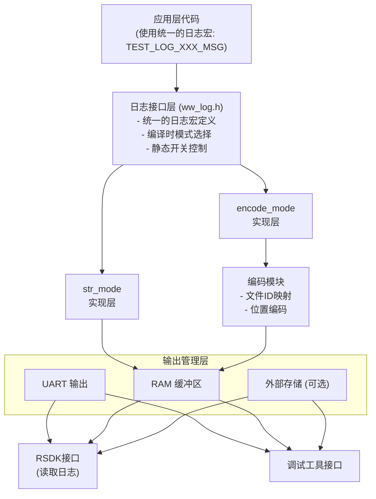
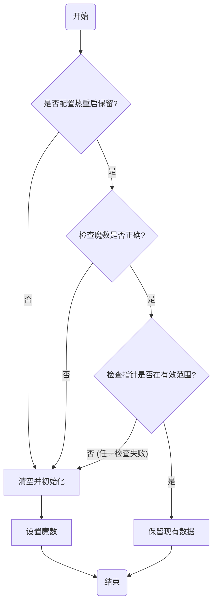

# 日志模块重构设计方案

## 文档版本控制

| 版本 | 日期       | 作者  | 修改说明 |
| ---- | ---------- | ----- | -------- |
| v0.1 | 2025-11-17 | [Sam] | 初始版本 |

------

## 1. 项目背景与目标

### 1.1 当前问题分析

当前系统使用的`str_mode`日志模块存在以下问题:

1. **代码空间占用过大**
   - 每个日志点都需要存储完整的格式化字符串
   - 典型的日志字符串占用50-100字节
   - 如果项目中有500个日志点,仅字符串就占用25KB-50KB
   - printf家族函数的链接会引入额外的库代码(约5-10KB)
2. **RAM占用问题**
   - 格式化字符串处理需要栈空间
   - 每次日志调用可能需要100-200字节的栈空间
3. **可扩展性差**
   - 字符串模式下难以实现日志的持久化存储
   - 无法有效实现日志的统计分析功能

### 1.2 项目目标

1. **主要目标**
   - 将代码空间占用减少60%-80%
   - 将运行时RAM占用减少50%以上
   - 保持完整的日志信息追溯能力
2. **次要目标**
   - 提供统一的日志接口,支持模式切换
   - 支持编译时和运行时的日志开关
   - 支持多种输出目标(UART/RAM/外部存储)
   - 提供配套的日志解析工具

### 1.3 设计约束

1. **兼容性约束**
   - 必须保持现有日志调用接口不变
   - 两种模式只能选择其一编译,不能同时存在
2. **资源约束**
   - RAM缓冲区大小可配置,默认建议64-128条
   - 外部存储(如果使用)容量有限,需要考虑磨损均衡
3. **性能约束**
   - 单次日志记录操作不应超过100微秒
   - 临界区保护时间应尽可能短

------

## 2. 总体架构设计

### 2.1 系统架构图



### 2.2 模块划分

| 模块名称        | 文件               | 职责                          |
| --------------- | ------------------ | ----------------------------- |
| 日志接口层      | `ww_log.h`         | 定义统一的日志宏,提供编译开关 |
| 文件ID管理      | `log_file_id.h`    | 集中管理所有源文件的唯一编号  |
| str_mode实现    | `ww_log_str.c`     | 传统字符串日志的实现          |
| encode_mode实现 | `ww_log_encode.c`  | 编码日志的实现                |
| RAM缓冲区管理   | `ww_log_ram.c`     | 环形缓冲区的操作              |
| 外存管理(可选)  | `ww_log_storage.c` | 外部存储的读写操作            |
| 配置管理        | `ww_log_config.h`  | 所有可配置参数的定义          |
| RSDK接口        | `ww_log_api.c`     | 提供给外部工具的读取接口      |

### 2.3 编译配置方案

通过宏定义控制编译选项:

```c
// ww_log_config.h

// ============ 模式选择 (二选一) ============
CONFIG_WW_LOG_STR_MODE is not set       // 字符串模式
#define CONFIG_WW_LOG_ENCODE_MODE       // 编码模式

// ============ 全局日志级别 ============
#define CONFIG_WW_LOG_LEVEL_DEFAULT     WW_LOG_LEVEL_ERR

// ============ 输出目标选择 ============
#define CONFIG_WW_LOG_OUTPUT_UART       // 输出到UART
#define CONFIG_WW_LOG_OUTPUT_RAM        // 保存到RAM
// #define CONFIG_WW_LOG_OUTPUT_FLASH   // 保存到Flash(可选)

// ============ RAM缓冲区配置 ============
#define CONFIG_WW_LOG_RAM_ENTRY_NUM     64    // 缓冲区条目数
#define CONFIG_WW_LOG_RAM_PERSISTENT    1     // 热重启后保留

// ============ 子模块静态开关 ============
#define CONFIG_WW_LOG_MOD_BOOT_EN       // 使能BOOT模块日志
#define CONFIG_WW_LOG_MOD_APP_EN        // 使能APP模块日志
// #define CONFIG_WW_LOG_MOD_TEST_EN   // 禁用TEST模块日志
```

------

## 3. 文件编号管理

### 3.1 设计思路

使用枚举集中管理所有源文件的唯一编号,确保全局唯一性和易维护性。

### 3.2 文件ID枚举定义

```c
// log_file_id.h
#ifndef LOG_FILE_ID_H
#define LOG_FILE_ID_H

/**
 * 文件编号枚举
 * 说明:
 * 1. 每个需要打印日志的.c文件都应该在此枚举中分配一个唯一ID
 * 2. 枚举值会自动递增,无需手动指定数值
 * 3. ID范围: 1-4095 (12位可表示)
 * 4. 添加新文件时,在对应分类下添加即可
 */
typedef enum {
    FILE_ID_INVALID = 0,
    
    /* 系统初始化模块 (1-50) */
    FILE_ID_MAIN,
    FILE_ID_SYSTEM_INIT,
    FILE_ID_CLOCK_CONFIG,
    FILE_ID_POWER_MANAGER,
    
    /* 驱动层模块 (51-150) */
    FILE_ID_I2C_DRIVER = 51,
    FILE_ID_SPI_DRIVER,
    FILE_ID_UART_DRIVER,
    FILE_ID_GPIO_DRIVER,
    FILE_ID_ADC_DRIVER,
    
    /* 传感器模块 (151-250) */
    FILE_ID_SENSOR_TEMPERATURE = 151,
    FILE_ID_SENSOR_PRESSURE,
    FILE_ID_SENSOR_HUMIDITY,
    
    /* 算法模块 (251-350) */
    FILE_ID_TEMP_CONTROL = 251,
    FILE_ID_PID_ALGORITHM,
    FILE_ID_FILTER_MODULE,
    
    /* 通信模块 (351-450) */
    FILE_ID_PROTOCOL_HANDLER = 351,
    FILE_ID_UART_COMM,
    FILE_ID_NETWORK_STACK,
    
    /* 应用层模块 (451-550) */
    FILE_ID_APP_MAIN = 451,
    FILE_ID_STATE_MACHINE,
    FILE_ID_ERROR_HANDLER,
    
    FILE_ID_MAX  // 边界值,用于检查
} LOG_FILE_ID_E;

/* 编译时检查文件ID是否超出12位范围 */
#if (FILE_ID_MAX > 4095)
#error "File ID exceeds 12-bit range (max 4095)"
#endif

#endif /* LOG_FILE_ID_H */
```

### 3.3 使用方法

在每个需要打印日志的.c文件开头定义当前文件ID:

```c
// sensor_temperature.c
#include "log_file_id.h"
#include "ww_log.h"

// 定义当前文件的ID
#define CURRENT_FILE_ID  FILE_ID_SENSOR_TEMPERATURE

// 后续使用日志宏时会自动使用这个ID
void temp_sensor_init(void) {
    TEST_LOG_INFO_MSG("Temperature sensor initializing...");
    // ...
}
```

### 3.4 文件ID管理最佳实践

1. **分类管理**
   - 按功能模块划分ID段
   - 预留足够的增长空间
   - 在注释中标明每个段的范围
2. **版本控制**
   - 文件ID一旦分配就不要修改
   - 删除文件时保留ID但标记为废弃
   - 新文件使用新的ID
3. **文档同步**
   - 维护一份ID到文件名的映射表
   - 在代码审查时检查ID分配
   - 定期review ID使用情况

------

## 4. 日志级别定义

```c
// ww_log.h

/**
 * 日志级别定义
 * 级别越低越重要,数值越小
 */
typedef enum {
    WW_LOG_LEVEL_OFF = 0,   // 关闭所有日志
    WW_LOG_LEVEL_ERR = 1,   // 错误:系统异常,需要立即关注
    WW_LOG_LEVEL_WRN = 2,   // 警告:潜在问题,建议关注
    WW_LOG_LEVEL_INF = 3,   // 信息:关键流程节点
    WW_LOG_LEVEL_DBG = 4,   // 调试:详细的调试信息
} WW_LOG_LEVEL_E;

// 级别字符串,用于str_mode输出
static const char* g_log_level_str[] = {
    "OFF",
    "ERR",
    "WRN", 
    "INF",
    "DBG"
};
```

### 4.1 日志级别使用指导

**ERROR (错误)级别:**

- 系统无法正常工作的错误
- 数据损坏或丢失
- 硬件故障
- 致命的配置错误
- 示例: `TEST_LOG_ERR_MSG("I2C init failed, ret=%d", ret);`

**WARNING (警告)级别:**

- 潜在的问题,但系统仍能工作
- 资源接近耗尽
- 配置不合理但可以容忍
- 性能下降
- 示例: `TEST_LOG_WRN_MSG("Buffer usage: %d/%d", used, total);`

**INFO (信息)级别:**

- 重要的系统状态变化
- 关键流程的开始和结束
- 重要参数的配置
- 示例: `TEST_LOG_INF_MSG("System initialized, version=%s", ver);`

**DEBUG (调试)级别:**

- 详细的执行流程
- 中间变量的值
- 算法的每一步
- 示例: `TEST_LOG_DBG_MSG("PID: e=%d, i=%d, d=%d", e, i, d);`

------

## 5. 统一日志接口设计

### 5.1 基础日志宏

```c
// ww_log.h

/**
 * 通用日志宏
 * 根据编译配置自动选择str_mode或encode_mode
 */
#ifdef CONFIG_WW_LOG_ENCODE_MODE
    // ========== encode_mode实现 ==========
    #define TEST_LOG_ERR_MSG(fmt, ...) \
        LOG_ENCODE_WRITE(WW_LOG_LEVEL_ERR, fmt, ##__VA_ARGS__)
    
    #define TEST_LOG_WRN_MSG(fmt, ...) \
        LOG_ENCODE_WRITE(WW_LOG_LEVEL_WRN, fmt, ##__VA_ARGS__)
    
    #define TEST_LOG_INF_MSG(fmt, ...) \
        LOG_ENCODE_WRITE(WW_LOG_LEVEL_INF, fmt, ##__VA_ARGS__)
    
    #define TEST_LOG_DBG_MSG(fmt, ...) \
        LOG_ENCODE_WRITE(WW_LOG_LEVEL_DBG, fmt, ##__VA_ARGS__)

#else  // CONFIG_WW_LOG_STR_MODE
    // ========== str_mode实现 ==========
    #define TEST_LOG_ERR_MSG(fmt, ...) \
        LOG_STR_WRITE(WW_LOG_LEVEL_ERR, fmt, ##__VA_ARGS__)
    
    #define TEST_LOG_WRN_MSG(fmt, ...) \
        LOG_STR_WRITE(WW_LOG_LEVEL_WRN, fmt, ##__VA_ARGS__)
    
    #define TEST_LOG_INF_MSG(fmt, ...) \
        LOG_STR_WRITE(WW_LOG_LEVEL_INF, fmt, ##__VA_ARGS__)
    
    #define TEST_LOG_DBG_MSG(fmt, ...) \
        LOG_STR_WRITE(WW_LOG_LEVEL_DBG, fmt, ##__VA_ARGS__)
#endif
```

### 5.2 带模块名的日志宏

支持为不同子模块定义专用的日志宏,方便分类管理:

```c
// ww_log.h

// INIT模块日志宏
#ifdef CONFIG_WW_LOG_MOD_INIT_EN
    #define WW_INIT_LOG_ERR(fmt, ...)  TEST_LOG_ERR_MSG(fmt, ##__VA_ARGS__)
    #define WW_INIT_LOG_WRN(fmt, ...)  TEST_LOG_WRN_MSG(fmt, ##__VA_ARGS__)
    #define WW_INIT_LOG_INF(fmt, ...)  TEST_LOG_INF_MSG(fmt, ##__VA_ARGS__)
    #define WW_INIT_LOG_DBG(fmt, ...)  TEST_LOG_DBG_MSG(fmt, ##__VA_ARGS__)
#else
    // 编译时关闭,宏定义为空
    #define WW_INIT_LOG_ERR(fmt, ...)
    #define WW_INIT_LOG_WRN(fmt, ...)
    #define WW_INIT_LOG_INF(fmt, ...)
    #define WW_INIT_LOG_DBG(fmt, ...)
#endif

// SENSOR模块日志宏
#ifdef CONFIG_WW_LOG_MOD_SENSOR_EN
    #define WW_SENSOR_LOG_ERR(fmt, ...) TEST_LOG_ERR_MSG(fmt, ##__VA_ARGS__)
    #define WW_SENSOR_LOG_WRN(fmt, ...) TEST_LOG_WRN_MSG(fmt, ##__VA_ARGS__)
    #define WW_SENSOR_LOG_INF(fmt, ...) TEST_LOG_INF_MSG(fmt, ##__VA_ARGS__)
    #define WW_SENSOR_LOG_DBG(fmt, ...) TEST_LOG_DBG_MSG(fmt, ##__VA_ARGS__)
#else
    #define WW_SENSOR_LOG_ERR(fmt, ...)
    #define WW_SENSOR_LOG_WRN(fmt, ...)
    #define WW_SENSOR_LOG_INF(fmt, ...)
    #define WW_SENSOR_LOG_DBG(fmt, ...)
#endif

// MOTOR模块日志宏
#ifdef CONFIG_WW_LOG_MOD_MOTOR_EN
    #define WW_MOTOR_LOG_ERR(fmt, ...) TEST_LOG_ERR_MSG(fmt, ##__VA_ARGS__)
    #define WW_MOTOR_LOG_WRN(fmt, ...) TEST_LOG_WRN_MSG(fmt, ##__VA_ARGS__)
    #define WW_MOTOR_LOG_INF(fmt, ...) TEST_LOG_INF_MSG(fmt, ##__VA_ARGS__)
    #define WW_MOTOR_LOG_DBG(fmt, ...) TEST_LOG_DBG_MSG(fmt, ##__VA_ARGS__)
#else
    #define WW_MOTOR_LOG_ERR(fmt, ...)
    #define WW_MOTOR_LOG_WRN(fmt, ...)
    #define WW_MOTOR_LOG_INF(fmt, ...)
    #define WW_MOTOR_LOG_DBG(fmt, ...)
#endif

// 可以继续添加其他模块...
```

### 5.3 使用示例

```c
// main.c
#define CURRENT_FILE_ID  FILE_ID_MAIN
#include "ww_log.h"

void main(void) {
    // 使用通用日志宏
    TEST_LOG_INF_MSG("System starting...");
    
    // 使用模块专用宏
    WW_INIT_LOG_INF("Initializing peripherals");
    
    int ret = init_system();
    if (ret != 0) {
        TEST_LOG_ERR_MSG("System init failed, ret=%d", ret);
    }
}
```

## 6. encode_mode详细设计

### 6.1 编码格式定义

使用32位整数编码日志信息,位域分配如下:

```
 31                    20 19                8 7       4 3      0
┌──────────────────────┬────────────────────┬─────────┬────────┐
│   File ID (12 bits)  │  Line No (12 bits) │Reserved │ Level  │
│      0-4095          │     0-4095         │ (4 bits)│(4 bits)│
└──────────────────────┴────────────────────┴─────────┴────────┘

说明:
- Bits [31:20]: 文件ID,取值范围0-4095
- Bits [19:8]:  行号,取值范围0-4095  
- Bits [7:4]:   保留位,可用于扩展(如时间戳压缩、任务ID等)
- Bits [3:0]:   日志级别,取值0-15
```

### 6.2 编码宏定义

```c
// ww_log_encode.h

// 位域位置定义
#define LOG_ENCODE_FILE_ID_SHIFT    20
#define LOG_ENCODE_LINE_NUM_SHIFT   8
#define LOG_ENCODE_RESERVED_SHIFT   4
#define LOG_ENCODE_LEVEL_SHIFT      0

// 位域掩码
#define LOG_ENCODE_FILE_ID_MASK     0xFFF00000
#define LOG_ENCODE_LINE_NUM_MASK    0x000FFF00
#define LOG_ENCODE_RESERVED_MASK    0x000000F0
#define LOG_ENCODE_LEVEL_MASK       0x0000000F

/**
 * 编码宏:将文件ID、行号、级别组合成32位整数
 */
#define LOG_ENCODE_PACK(file_id, line, level) \
    ((((U32)(file_id) & 0xFFF) << LOG_ENCODE_FILE_ID_SHIFT) | \
     (((U32)(line) & 0xFFF) << LOG_ENCODE_LINE_NUM_SHIFT) | \
     ((U32)(level) & 0xF))

/**
 * 解码宏:从32位整数中提取各字段
 */
#define LOG_DECODE_FILE_ID(encoded)  (((encoded) >> LOG_ENCODE_FILE_ID_SHIFT) & 0xFFF)
#define LOG_DECODE_LINE_NUM(encoded) (((encoded) >> LOG_ENCODE_LINE_NUM_SHIFT) & 0xFFF)
#define LOG_DECODE_LEVEL(encoded)    ((encoded) & 0xF)
```

### 6.3 encode_mode核心函数

```c
// ww_log_encode.c

/**
 * encode_mode日志写入函数
 * 
 * @param level    日志级别
 * @param param1   可选参数1 (如错误码)
 * @param param2   可选参数2
 * 
 * 说明:
 * - 此函数会被日志宏调用
 * - 根据配置输出到UART和/或保存到RAM
 */
void log_encode_write(U8 level, U32 param1, U32 param2) {
    U32 encoded_info;
    
    // 动态级别过滤
    if (level > CONFIG_WW_LOG_LEVEL_DEFAULT) {
        return;  // 级别不够,直接返回
    }
    
    // 编码位置信息
    // 注意: CURRENT_FILE_ID和__LINE__在调用处已经确定
    // 这里需要通过宏展开来获取
    encoded_info = LOG_ENCODE_PACK(CURRENT_FILE_ID, __LINE__, level);
    
    #ifdef CONFIG_WW_LOG_OUTPUT_UART
    // 输出到UART (以十六进制格式,便于调试)
    uart_printf("LOG: %08X", encoded_info);
    if (param1 != 0) {
        uart_printf(" %08X", param1);
    }
    if (param2 != 0) {
        uart_printf(" %08X", param2);
    }
    uart_printf("\n");
    #endif
    
    #ifdef CONFIG_WW_LOG_OUTPUT_RAM
    // 保存到RAM缓冲区
    log_ram_write_entry(encoded_info, param1, param2);
    #endif
}

/**
 * 日志写入宏的实际实现
 * 这个宏会在各个日志宏中被调用
 */
#define LOG_ENCODE_WRITE(level, fmt, ...) \
    do { \
        /* 编译时级别检查 */ \
        if ((level) <= CONFIG_WW_LOG_LEVEL_DEFAULT) { \
            U32 _encoded = LOG_ENCODE_PACK(CURRENT_FILE_ID, __LINE__, level); \
            /* 提取参数 - 这里需要根据实际参数个数调整 */ \
            log_encode_write_internal(_encoded, ##__VA_ARGS__); \
        } \
    } while(0)

/**
 * 内部写入函数,处理不同参数数量
 */
static inline void log_encode_write_internal(U32 encoded, ...) {
    va_list args;
    U32 param1 = 0, param2 = 0;
    
    va_start(args, encoded);
    
    // 尝试获取第一个参数
    param1 = va_arg(args, U32);
    
    // 尝试获取第二个参数
    param2 = va_arg(args, U32);
    
    va_end(args);
    
    // 实际写入
    #ifdef CONFIG_WW_LOG_OUTPUT_UART
    uart_printf("LOG: %08X", encoded);
    if (param1 != 0) {
        uart_printf(" %08X", param1);
    }
    if (param2 != 0) {
        uart_printf(" %08X", param2);
    }
    uart_printf("\n");
    #endif
    
    #ifdef CONFIG_WW_LOG_OUTPUT_RAM
    log_ram_write_entry(encoded, param1, param2);
    #endif
}
```

### 6.4 带参数的日志接口

为了支持在encode_mode下传递参数(如错误码),需要提供专门的接口:

```c
// ww_log.h

#ifdef CONFIG_WW_LOG_ENCODE_MODE

/**
 * 仅记录位置,不带参数
 */
#define LOG_ONLY() \
    do { \
        U32 _enc = LOG_ENCODE_PACK(CURRENT_FILE_ID, __LINE__, WW_LOG_LEVEL_INF); \
        log_ram_write_entry(_enc, 0, 0); \
    } while(0)

/**
 * 记录位置+1个参数
 * 常用于记录错误码、返回值等
 */
#define LOG_WITH_U32(param1) \
    do { \
        U32 _enc = LOG_ENCODE_PACK(CURRENT_FILE_ID, __LINE__, WW_LOG_LEVEL_ERR); \
        log_ram_write_entry(_enc, (U32)(param1), 0); \
    } while(0)

/**
 * 记录位置+2个参数  
 * 常用于记录地址+数据、配置参数等
 */
#define LOG_WITH_2U32(param1, param2) \
    do { \
        U32 _enc = LOG_ENCODE_PACK(CURRENT_FILE_ID, __LINE__, WW_LOG_LEVEL_ERR); \
        log_ram_write_entry(_enc, (U32)(param1), (U32)(param2)); \
    } while(0)

/**
 * 记录位置+数据块
 * 用于记录缓冲区内容
 * 注意:这个会占用多个日志条目
 */
void log_encode_write_data(U8 level, U8* data, U16 len);

#define LOG_WITH_DATA(ptr, len) \
    log_encode_write_data(WW_LOG_LEVEL_ERR, (U8*)(ptr), (len))

#endif
```

### 6.5 数据块记录实现

```c
// ww_log_encode.c

/**
 * 记录数据块
 * 
 * @param level  日志级别
 * @param data   数据指针
 * @param len    数据长度(字节)
 * 
 * 说明:
 * - 数据会被拆分成多个32位整数存储
 * - 第一条记录包含位置信息和长度
 * - 后续记录存储实际数据
 */
void log_encode_write_data(U8 level, U8* data, U16 len) {
    U32 encoded;
    U32 *p_data32;
    U16 word_count;
    int i;
    
    if (data == NULL || len == 0) {
        return;
    }
    
    // 动态级别过滤
    if (level > CONFIG_WW_LOG_LEVEL_DEFAULT) {
        return;
    }
    
    // 第一条:位置信息 + 长度
    encoded = LOG_ENCODE_PACK(CURRENT_FILE_ID, __LINE__, level);
    log_ram_write_entry(encoded, len, 0);
    
    // 计算需要多少个32位字
    word_count = (len + 3) / 4;
    p_data32 = (U32*)data;
    
    // 存储数据,每条最多2个32位字(8字节)
    for (i = 0; i < word_count; i += 2) {
        U32 w1 = p_data32[i];
        U32 w2 = (i + 1 < word_count) ? p_data32[i + 1] : 0;
        log_ram_write_entry(0, w1, w2);  // encoded=0表示这是数据延续
    }
}
```

------

## 7. str_mode详细设计

### 7.1 str_mode实现

```c
// ww_log_str.c

/**
 * str_mode日志输出函数
 * 
 * @param file     源文件名
 * @param line     行号
 * @param func     函数名
 * @param level    日志级别
 * @param fmt      格式化字符串
 * @param ...      可变参数
 */
void log_str_write(const char* file, int line, const char* func, 
                   U8 level, const char* fmt, ...) {
    char buf[128];
    va_list args;
    int len;
    
    // 动态级别过滤
    if (level > CONFIG_WW_LOG_LEVEL_DEFAULT) {
        return;
    }
    
    // 格式化用户消息
    va_start(args, fmt);
    len = vsnprintf(buf, sizeof(buf), fmt, args);
    va_end(args);
    
    // 输出到UART
    #ifdef CONFIG_WW_LOG_OUTPUT_UART
    uart_printf("[%s] %s:%d:%s: %s\n", 
                g_log_level_str[level], file, line, func, buf);
    #endif
    
    // str_mode通常不保存到RAM,因为占用空间太大
    // 如果确实需要,可以保存格式化后的字符串
}

/**
 * 日志写入宏的实际实现
 */
#define LOG_STR_WRITE(level, fmt, ...) \
    do { \
        if ((level) <= CONFIG_WW_LOG_LEVEL_DEFAULT) { \
            log_str_write(__FILE__, __LINE__, __FUNCTION__, \
                         (level), fmt, ##__VA_ARGS__); \
        } \
    } while(0)
```

### 7.2 str_mode优化建议

虽然str_mode占用空间大,但在某些场景下仍然有用:

1. **开发早期阶段**
   - 快速定位问题
   - 不需要解析工具
   - 直观的输出
2. **优化技巧**
   - 使用短文件名(basename)而不是完整路径
   - 精简日志消息
   - 移除不必要的函数名输出

```c
// 优化的str_mode输出
void log_str_write_optimized(const char* file, int line, U8 level, 
                             const char* fmt, ...) {
    char buf[64];  // 减小缓冲区
    va_list args;
    
    // 只使用文件名,不包含路径
    const char* basename = strrchr(file, '/');
    if (basename) {
        basename++;
    } else {
        basename = file;
    }
    
    va_start(args, fmt);
    vsnprintf(buf, sizeof(buf), fmt, args);
    va_end(args);
    
    // 精简的输出格式
    uart_printf("[%c] %s:%d %s\n", 
                g_log_level_str[level][0],  // 只用首字母
                basename, line, buf);
}
```

------

## 8. 两种模式对比

### 8.1 功能对比

| 特性       | str_mode       | encode_mode          |
| ---------- | -------------- | -------------------- |
| 代码空间   | 大(~50KB)      | 小(~3KB)             |
| RAM占用    | 大(栈~200B/次) | 小(栈~50B/次)        |
| 执行速度   | 慢(~150μs)     | 快(~15μs)            |
| 可读性     | 直接可读       | 需要解析工具         |
| 参数支持   | 完整支持       | 有限支持(最多2个U32) |
| 实时性     | 差             | 好                   |
| 开发便利性 | 高             | 中                   |
| 生产适用性 | 低             | 高                   |

### 8.2 使用场景建议

**使用str_mode的场景:**

- 项目早期开发阶段
- 代码空间充足的平台
- 需要频繁查看日志的调试场景
- 团队对encode_mode不熟悉

**使用encode_mode的场景:**

- 代码空间紧张(接近上限)
- 生产环境
- 需要长期保存日志
- 对实时性要求高的系统

### 8.3 混合使用策略

虽然设计要求二选一,但可以在项目不同阶段切换:

```
开发阶段 → str_mode (快速调试)
         ↓
测试阶段 → encode_mode (接近生产环境)
         ↓
生产环境 → encode_mode (节省空间)
```

通过配置文件切换,保持代码不变:

```c
// 开发版本 - config_dev.h
#define CONFIG_WW_LOG_STR_MODE
#define CONFIG_WW_LOG_LEVEL_DEFAULT  WW_LOG_LEVEL_DBG

// 生产版本 - config_release.h
#define CONFIG_WW_LOG_ENCODE_MODE
#define CONFIG_WW_LOG_LEVEL_DEFAULT  WW_LOG_LEVEL_ERR
```

编译时选择对应的配置文件即可。

## 9. RAM缓冲区管理

### 9.1 数据结构定义

```c
// ww_log_ram.h

/**
 * 单条日志条目结构
 * 说明:
 * - encode_mode下,每条日志可能包含1-3个U32数据
 * - entry[0]: 编码的位置信息(文件ID+行号+级别)
 * - entry[1]: 可选参数1
 * - entry[2]: 可选参数2
 */
typedef struct {
    U32 entry[3];       // 最多3个U32数据
    U8  entry_count;    // 实际有效的entry数量(1-3)
    U8  read_flag;      // 读取标志: 0=未读, 1=已读
    U16 reserved;       // 保留,用于对齐
} LOG_ENTRY_T;

/**
 * RAM日志缓冲区管理结构
 * 说明:
 * - 使用环形缓冲区管理
 * - 支持热重启保留(通过特殊链接脚本段配置)
 */
typedef struct {
    U32 magic_head;                              // 魔数头,用于校验(0x4C4F4748='LOGH')
    U16 entry_head;                              // 读指针(最老的日志位置)
    U16 entry_tail;                              // 写指针(下一条日志写入位置)
    U32 write_count;                             // 累计写入计数(用于生成序列号)
    U32 read_count;                              // 累计读取计数
    U32 overflow_count;                          // 溢出计数(缓冲区满导致的丢弃)
    LOG_ENTRY_T entries[CONFIG_WW_LOG_RAM_ENTRY_NUM];  // 日志条目数组
    U32 magic_tail;                              // 魔数尾,用于校验(0x4C4F4754='LOGT')
} WW_LOG_RAM_T;

/**
 * 全局日志缓冲区
 * 说明:
 * - 使用__attribute__((section(".noinit")))放到特殊段,热重启不清零
 * - 冷启动时需要检查magic数来判断是否有效
 */
#ifdef CONFIG_WW_LOG_RAM_PERSISTENT
__attribute__((section(".noinit"))) WW_LOG_RAM_T g_log_ram;
#else
WW_LOG_RAM_T g_log_ram;
#endif
```

### 9.2 缓冲区初始化

```c
// ww_log_ram.c

/**
 * 日志缓冲区初始化
 * 
 * @param force_clear  是否强制清空: 1=清空, 0=尝试保留
 * 
 * 说明:
 * - 系统初始化时调用
 * - 如果检测到有效的魔数且force_clear=0,则保留现有日志
 * - 否则清空缓冲区
 */
void log_ram_init(U8 force_clear) {
    U8 valid = 0;
    
    #ifdef CONFIG_WW_LOG_RAM_PERSISTENT
    // 检查魔数是否有效
    if (g_log_ram.magic_head == 0x4C4F4748 && 
        g_log_ram.magic_tail == 0x4C4F4754 &&
        !force_clear) {
        
        // 进一步检查数据一致性
        if (g_log_ram.entry_head < CONFIG_WW_LOG_RAM_ENTRY_NUM &&
            g_log_ram.entry_tail < CONFIG_WW_LOG_RAM_ENTRY_NUM) {
            valid = 1;
            
            #ifdef DEBUG
            uart_printf("Log buffer preserved after warm reset\n");
            uart_printf("  Head: %d, Tail: %d, Count: %d\n",
                      g_log_ram.entry_head, g_log_ram.entry_tail,
                      log_ram_get_count());
            #endif
        }
    }
    #endif
    
    if (!valid) {
        // 魔数无效或强制清空,初始化缓冲区
        memset(&g_log_ram, 0, sizeof(g_log_ram));
        g_log_ram.magic_head = 0x4C4F4748;
        g_log_ram.magic_tail = 0x4C4F4754;
        g_log_ram.entry_head = 0;
        g_log_ram.entry_tail = 0;
        
        #ifdef DEBUG
        uart_printf("Log buffer initialized\n");
        #endif
    }
}

/**
 * 检查缓冲区是否为空
 */
static inline U8 log_ram_is_empty(void) {
    return (g_log_ram.entry_head == g_log_ram.entry_tail);
}

/**
 * 检查缓冲区是否已满
 */
static inline U8 log_ram_is_full(void) {
    U16 next_tail = (g_log_ram.entry_tail + 1) % CONFIG_WW_LOG_RAM_ENTRY_NUM;
    return (next_tail == g_log_ram.entry_head);
}

/**
 * 获取缓冲区中的日志条数
 */
U16 log_ram_get_count(void) {
    if (g_log_ram.entry_tail >= g_log_ram.entry_head) {
        return g_log_ram.entry_tail - g_log_ram.entry_head;
    } else {
        return CONFIG_WW_LOG_RAM_ENTRY_NUM - g_log_ram.entry_head + g_log_ram.entry_tail;
    }
}
```




### 9.3 日志写入操作

```c
// ww_log_ram.c

/**
 * 向RAM缓冲区写入一条日志
 * 
 * @param entry0   编码的位置信息(必需)
 * @param entry1   参数1(可选,0表示无效)
 * @param entry2   参数2(可选,0表示无效)
 * 
 * @return 0=成功, -1=失败
 * 
 * 说明:
 * - 此函数需要临界区保护
 * - 如果缓冲区满,根据策略处理(覆盖或丢弃)
 */
int log_ram_write_entry(U32 entry0, U32 entry1, U32 entry2) {
    U16 next_tail;
    LOG_ENTRY_T *p_entry;
    U8 entry_count = 1;
    
    // 计算有效entry数量
    if (entry1 != 0) entry_count = 2;
    if (entry2 != 0) entry_count = 3;
    
    // 临界区保护开始
    ENTER_CRITICAL_SECTION();
    
    // 检查是否满
    if (log_ram_is_full()) {
        // 获取级别,判断是否为ERROR
        U8 level = LOG_DECODE_LEVEL(entry0);
        
        if (level == WW_LOG_LEVEL_ERR) {
            // ERROR级别日志,检查最老的日志是否已读
            if (g_log_ram.entries[g_log_ram.entry_head].read_flag == 0) {
                // 未读,不能覆盖,记录溢出
                g_log_ram.overflow_count++;
                EXIT_CRITICAL_SECTION();
                return -1;
            }
        }
        
        // 非ERROR或已读,可以覆盖,head前移
        g_log_ram.entry_head = (g_log_ram.entry_head + 1) % CONFIG_WW_LOG_RAM_ENTRY_NUM;
        g_log_ram.overflow_count++;
    }
    
    // 写入日志到tail位置
    p_entry = &g_log_ram.entries[g_log_ram.entry_tail];
    p_entry->entry[0] = entry0;
    p_entry->entry[1] = entry1;
    p_entry->entry[2] = entry2;
    p_entry->entry_count = entry_count;
    p_entry->read_flag = 0;  // 标记为未读
    
    // 更新tail指针
    next_tail = (g_log_ram.entry_tail + 1) % CONFIG_WW_LOG_RAM_ENTRY_NUM;
    g_log_ram.entry_tail = next_tail;
    
    // 更新写入计数
    g_log_ram.write_count++;
    
    // 临界区保护结束
    EXIT_CRITICAL_SECTION();
    
    return 0;
}
```

### 9.4 日志读取操作

```c
// ww_log_ram.c

/**
 * 从RAM缓冲区读取一条日志
 * 
 * @param p_entry  输出参数,保存读取的日志条目
 * 
 * @return 0=成功, -1=缓冲区为空
 * 
 * 说明:
 * - 读取后不删除,只标记为已读
 * - 工具可以多次读取同一条日志
 */
int log_ram_read_entry(LOG_ENTRY_T *p_entry) {
    LOG_ENTRY_T *p_src;
    
    if (p_entry == NULL) {
        return -1;
    }
    
    ENTER_CRITICAL_SECTION();
    
    // 检查是否为空
    if (log_ram_is_empty()) {
        EXIT_CRITICAL_SECTION();
        return -1;
    }
    
    // 从head位置读取
    p_src = &g_log_ram.entries[g_log_ram.entry_head];
    
    // 复制数据
    memcpy(p_entry, p_src, sizeof(LOG_ENTRY_T));
    
    // 标记为已读
    p_src->read_flag = 1;
    
    // head指针前移
    g_log_ram.entry_head = (g_log_ram.entry_head + 1) % CONFIG_WW_LOG_RAM_ENTRY_NUM;
    
    // 更新读取计数
    g_log_ram.read_count++;
    
    EXIT_CRITICAL_SECTION();
    
    return 0;
}

/**
 * 清空RAM缓冲区
 * 
 * 说明:
 * - 仅清空日志数据,保留统计信息
 */
void log_ram_clear(void) {
    ENTER_CRITICAL_SECTION();
    
    g_log_ram.entry_head = 0;
    g_log_ram.entry_tail = 0;
    
    // 可选:清空所有条目的read_flag
    for (int i = 0; i < CONFIG_WW_LOG_RAM_ENTRY_NUM; i++) {
        g_log_ram.entries[i].read_flag = 0;
    }
    
    EXIT_CRITICAL_SECTION();
}

/**
 * 获取缓冲区统计信息
 */
void log_ram_get_stats(U32 *p_write, U32 *p_read, U32 *p_overflow) {
    ENTER_CRITICAL_SECTION();
    
    if (p_write) *p_write = g_log_ram.write_count;
    if (p_read) *p_read = g_log_ram.read_count;
    if (p_overflow) *p_overflow = g_log_ram.overflow_count;
    
    EXIT_CRITICAL_SECTION();
}
```

### 9.5 环形缓冲区工作示例

让我用一个具体的例子说明环形缓冲区的工作过程。假设缓冲区大小为8:

```
初始状态:
位置:  0    1    2    3    4    5    6    7
      [ ]  [ ]  [ ]  [ ]  [ ]  [ ]  [ ]  [ ]
       ↑
    Head=Tail=0 (空)

写入3条日志后:
位置:  0    1    2    3    4    5    6    7
      [X]  [X]  [X]  [ ]  [ ]  [ ]  [ ]  [ ]
       ↑              ↑
      Head=0       Tail=3

读取1条日志后:
位置:  0    1    2    3    4    5    6    7
      [R]  [X]  [X]  [ ]  [ ]  [ ]  [ ]  [ ]
            ↑         ↑
         Head=1    Tail=3

继续写入6条日志(会翻转):
位置:  0    1    2    3    4    5    6    7
      [X]  [R]  [X]  [X]  [X]  [X]  [X]  [X]
       ↑    ↑
    Tail=1 Head=1 (满)

注: [X]=有效数据, [R]=已读数据, [ ]=空
```

------

## 10. 临界区保护

### 10.1 临界区保护的必要性

在多任务或中断环境下,如果不加保护,可能出现以下问题:

1. **数据竞争**
   - 两个任务同时修改`entry_tail`
   - 导致某些日志丢失或覆盖
2. **不一致状态**
   - 任务A正在写入数据
   - 任务B读取了不完整的数据
3. **指针错乱**
   - head和tail指针被并发修改
   - 导致环形缓冲区逻辑错误

### 10.2 保护方案设计

```c
// ww_log_critical.h

/**
 * 临界区保护的实现方式
 * 
 * 根据系统环境选择合适的保护方式:
 * 1. 裸机系统:使用关中断
 * 2. RTOS系统:使用互斥锁或关调度器
 */

#ifdef USE_RTOS
    // ========== RTOS环境:使用互斥锁 ==========
    #include "cmsis_os.h"
    
    extern osMutexId_t g_log_mutex;
    
    #define ENTER_CRITICAL_SECTION()  osMutexAcquire(g_log_mutex, osWaitForever)
    #define EXIT_CRITICAL_SECTION()   osMutexRelease(g_log_mutex)
    
    // 初始化互斥锁
    #define INIT_CRITICAL_SECTION() \
        do { \
            g_log_mutex = osMutexNew(NULL); \
        } while(0)

#else
    // ========== 裸机环境:使用关中断 ==========
    
    // ARM Cortex-M系列
    #ifdef __ARM_ARCH
        #define ENTER_CRITICAL_SECTION() \
            do { \
                __disable_irq(); \
            } while(0)
        
        #define EXIT_CRITICAL_SECTION() \
            do { \
                __enable_irq(); \
            } while(0)
    
    // 其他架构可以添加对应的实现
    #else
        #error "Unsupported architecture for critical section"
    #endif
    
    #define INIT_CRITICAL_SECTION()  // 裸机无需初始化
#endif
```

### 10.3 中断中使用日志的注意事项

在中断服务程序(ISR)中使用日志需要特别小心:

```c
/**
 * 中断中不能使用互斥锁!
 * 如果在RTOS环境下,ISR中需要单独的保护机制
 */
#ifdef USE_RTOS

// 中断专用的临界区保护
#define ENTER_CRITICAL_SECTION_ISR() \
    do { \
        __disable_irq(); \
    } while(0)

#define EXIT_CRITICAL_SECTION_ISR() \
    do { \
        __enable_irq(); \
    } while(0)

// ISR专用的日志写入函数
int log_ram_write_entry_isr(U32 entry0, U32 entry1, U32 entry2) {
    // 使用关中断而不是互斥锁
    ENTER_CRITICAL_SECTION_ISR();
    
    // ... 写入逻辑与普通函数相同
    
    EXIT_CRITICAL_SECTION_ISR();
    
    return 0;
}

#endif
```

### 10.4 优化临界区时间

临界区应该尽可能短,避免影响系统实时性:

**好的做法:**

```c
int log_ram_write_entry(U32 entry0, U32 entry1, U32 entry2) {
    U16 next_tail;
    LOG_ENTRY_T *p_entry;
    
    // 先在临界区外做准备工作
    U8 entry_count = 1;
    if (entry1 != 0) entry_count = 2;
    if (entry2 != 0) entry_count = 3;
    
    // 只在真正需要保护的地方使用临界区
    ENTER_CRITICAL_SECTION();
    
    // 快速检查和更新
    if (log_ram_is_full()) {
        // 简单处理
        g_log_ram.entry_head = (g_log_ram.entry_head + 1) % CONFIG_WW_LOG_RAM_ENTRY_NUM;
    }
    
    // 快速写入
    p_entry = &g_log_ram.entries[g_log_ram.entry_tail];
    p_entry->entry[0] = entry0;
    p_entry->entry[1] = entry1;
    p_entry->entry[2] = entry2;
    p_entry->entry_count = entry_count;
    
    // 更新指针
    g_log_ram.entry_tail = (g_log_ram.entry_tail + 1) % CONFIG_WW_LOG_RAM_ENTRY_NUM;
    
    EXIT_CRITICAL_SECTION();
    
    return 0;
}
```

**不好的做法:**

```c
int log_ram_write_entry_bad(U32 entry0, U32 entry1, U32 entry2) {
    ENTER_CRITICAL_SECTION();
    
    // 在临界区内做太多事情
    U8 entry_count = 1;
    if (entry1 != 0) entry_count = 2;
    if (entry2 != 0) entry_count = 3;
    
    // 复杂的判断逻辑
    if (log_ram_is_full()) {
        U8 level = LOG_DECODE_LEVEL(entry0);
        if (level == WW_LOG_LEVEL_ERR) {
            // 更多复杂判断...
        }
    }
    
    // UART输出(非常耗时!)
    uart_printf("LOG: %08X\n", entry0);
    
    // ... 
    
    EXIT_CRITICAL_SECTION();  // 临界区太长了!
    
    return 0;
}
```

### 10.5 无锁队列(高级选项)

对于高性能要求,可以考虑使用无锁环形缓冲区:

```c
/**
 * 单生产者单消费者无锁环形缓冲区
 * 
 * 说明:
 * - 适用于一个任务写入,一个任务读取的场景
 * - 使用内存屏障保证顺序
 * - 无需互斥锁,性能更高
 */

// 内存屏障宏定义
#define MEMORY_BARRIER()  __sync_synchronize()

int log_ram_write_entry_lockfree(U32 entry0, U32 entry1, U32 entry2) {
    U16 next_tail;
    LOG_ENTRY_T *p_entry;
    
    // 计算下一个tail位置
    next_tail = (g_log_ram.entry_tail + 1) % CONFIG_WW_LOG_RAM_ENTRY_NUM;
    
    // 检查是否满(不能等于head)
    if (next_tail == g_log_ram.entry_head) {
        return -1;  // 满了
    }
    
    // 写入数据
    p_entry = &g_log_ram.entries[g_log_ram.entry_tail];
    p_entry->entry[0] = entry0;
    p_entry->entry[1] = entry1;
    p_entry->entry[2] = entry2;
    
    // 内存屏障,确保数据写入完成
    MEMORY_BARRIER();
    
    // 更新tail(这是唯一会被写端修改的变量)
    g_log_ram.entry_tail = next_tail;
    
    return 0;
}

int log_ram_read_entry_lockfree(LOG_ENTRY_T *p_entry) {
    LOG_ENTRY_T *p_src;
    
    // 检查是否为空
    if (g_log_ram.entry_head == g_log_ram.entry_tail) {
        return -1;  // 空
    }
    
    // 读取数据
    p_src = &g_log_ram.entries[g_log_ram.entry_head];
    memcpy(p_entry, p_src, sizeof(LOG_ENTRY_T));
    
    // 内存屏障
    MEMORY_BARRIER();
    
    // 更新head(这是唯一会被读端修改的变量)
    g_log_ram.entry_head = (g_log_ram.entry_head + 1) % CONFIG_WW_LOG_RAM_ENTRY_NUM;
    
    return 0;
}
```

**注意:** 无锁队列实现复杂,需要对内存模型有深入理解。建议先使用互斥锁方案,确认性能瓶颈后再考虑优化。


## 11. RSDK接口设计

### 11.1 接口需求

RSDK(Runtime SDK)接口需要提供以下功能:

1. 查询日志缓冲区状态
2. 批量读取日志
3. 清空日志缓冲区
4. 动态调整日志级别

### 11.2 数据结构定义

```c
// ww_log_api.h

/**
 * 日志缓冲区信息结构
 */
typedef struct {
    U16 total_count;        // 缓冲区总容量
    U16 used_count;         // 当前使用的条目数
    U32 write_count;        // 累计写入次数
    U32 read_count;         // 累计读取次数
    U32 overflow_count;     // 溢出次数
} LOG_RAM_INFO_T;
```

### 11.3 API函数实现

```c
// ww_log_api.c

/**
 * 获取RAM缓冲区状态
 * 
 * @param p_info  输出参数,保存缓冲区信息
 */
void log_api_get_ram_info(LOG_RAM_INFO_T *p_info) {
    if (p_info == NULL) return;
    
    ENTER_CRITICAL_SECTION();
    
    p_info->total_count = CONFIG_WW_LOG_RAM_ENTRY_NUM;
    p_info->used_count = log_ram_get_count();
    p_info->write_count = g_log_ram.write_count;
    p_info->read_count = g_log_ram.read_count;
    p_info->overflow_count = g_log_ram.overflow_count;
    
    EXIT_CRITICAL_SECTION();
}

/**
 * 批量读取日志
 * 
 * @param buffer      输出缓冲区
 * @param max_count   最多读取的条目数
 * 
 * @return 实际读取的条目数
 * 
 * 说明:
 * - 读取后日志不会被删除,只是标记为已读
 * - 工具可以多次读取
 */
int log_api_read_entries(LOG_ENTRY_T *buffer, int max_count) {
    int count = 0;
    
    if (buffer == NULL || max_count <= 0) {
        return 0;
    }
    
    while (count < max_count) {
        if (log_ram_read_entry(&buffer[count]) != 0) {
            break;  // 缓冲区已空
        }
        count++;
    }
    
    return count;
}

/**
 * 清空RAM缓冲区
 */
void log_api_clear_ram(void) {
    log_ram_clear();
}
```

### 11.4 命令行接口

```c
// ww_log_api.c

/**
 * 命令行解析实现
 * 
 * @param cmd  命令字符串
 * 
 * 支持的命令:
 * - "log info"         : 获取缓冲区信息
 * - "log read <n>"     : 读取n条日志
 * - "log clear"        : 清空缓冲区
 * - "log level <n>"    : 动态设置日志级别
 */
void log_api_cmd_handler(const char *cmd) {
    if (strncmp(cmd, "log info", 8) == 0) {
        // 获取并显示缓冲区信息
        LOG_RAM_INFO_T info;
        log_api_get_ram_info(&info);
        uart_printf("Log Buffer Status:\n");
        uart_printf("  Total: %d\n", info.total_count);
        uart_printf("  Used: %d\n", info.used_count);
        uart_printf("  Write: %u\n", info.write_count);
        uart_printf("  Read: %u\n", info.read_count);
        uart_printf("  Overflow: %u\n", info.overflow_count);
    }
    else if (strncmp(cmd, "log read", 8) == 0) {
        // 读取日志
        int n = atoi(cmd + 9);  // 提取数字
        if (n <= 0 || n > 100) {
            uart_printf("Invalid count (1-100)\n");
            return;
        }
        
        LOG_ENTRY_T entries[100];
        int count = log_api_read_entries(entries, n);
        
        uart_printf("Read %d log entries:\n", count);
        for (int i = 0; i < count; i++) {
            uart_printf("[%d] ", i);
            for (int j = 0; j < entries[i].entry_count; j++) {
                uart_printf("%08X ", entries[i].entry[j]);
            }
            uart_printf("\n");
        }
    }
    else if (strncmp(cmd, "log clear", 9) == 0) {
        // 清空缓冲区
        log_api_clear_ram();
        uart_printf("Log buffer cleared\n");
    }
    else if (strncmp(cmd, "log level", 9) == 0) {
        // 动态设置日志级别
        int level = atoi(cmd + 10);
        if (level >= 0 && level <= 4) {
            extern U8 g_log_level_runtime;
            g_log_level_runtime = level;
            uart_printf("Log level set to %d\n", level);
        } else {
            uart_printf("Invalid level (0-4)\n");
        }
    }
    else {
        uart_printf("Unknown log command\n");
        uart_printf("Usage:\n");
        uart_printf("  log info\n");
        uart_printf("  log read <count>\n");
        uart_printf("  log clear\n");
        uart_printf("  log level <0-4>\n");
    }
}
```

### 11.5 集成到系统命令行

```c
// main.c 或 cli.c

// 命令表
typedef struct {
    const char *cmd;
    void (*handler)(const char *);
} CLI_CMD_T;

const CLI_CMD_T g_cli_cmds[] = {
    {"log", log_api_cmd_handler},
    {"help", cmd_help},
    {"reset", cmd_reset},
    // ... 其他命令
};

// 命令分发函数
void cli_process_cmd(const char *cmd_line) {
    for (int i = 0; i < sizeof(g_cli_cmds)/sizeof(CLI_CMD_T); i++) {
        int len = strlen(g_cli_cmds[i].cmd);
        if (strncmp(cmd_line, g_cli_cmds[i].cmd, len) == 0) {
            g_cli_cmds[i].handler(cmd_line);
            return;
        }
    }
    uart_printf("Unknown command\n");
}
```

------

## 12. 动态/静态开关实现

### 12.1 静态开关(编译时)

静态开关通过宏定义实现,在编译时决定某段代码是否包含。

```c
// ww_log_config.h

// ============ 全局日志开关 ============
#define CONFIG_WW_LOG_ENABLE  1  // 1=启用日志, 0=完全禁用

// ============ 子模块静态开关 ============
#define CONFIG_WW_LOG_MOD_INIT_EN      // 定义则启用
#define CONFIG_WW_LOG_MOD_SENSOR_EN    // 定义则启用
// #undef CONFIG_WW_LOG_MOD_MOTOR_EN   // 不定义则禁用
```

使用示例:

```c
// 在ww_log.h中

#if CONFIG_WW_LOG_ENABLE
    // 日志功能启用
    #ifdef CONFIG_WW_LOG_MOD_INIT_EN
        #define WW_INIT_LOG_ERR(fmt, ...)  TEST_LOG_ERR_MSG(fmt, ##__VA_ARGS__)
    #else
        #define WW_INIT_LOG_ERR(fmt, ...)  // 空实现,编译后无任何代码
    #endif
#else
    // 日志功能完全禁用,所有宏都为空
    #define WW_INIT_LOG_ERR(fmt, ...)
    #define TEST_LOG_ERR_MSG(fmt, ...)
    // ...
#endif
```

**静态开关的优势:**

- 编译后完全不占用代码空间
- 无运行时开销
- 适合长期不需要的日志

**静态开关的劣势:**

- 需要重新编译才能改变
- 不够灵活

### 12.2 动态开关(运行时)

动态开关通过运行时变量实现,可以在系统运行过程中改变日志行为。

#### 12.2.1 全局日志级别控制

```c
// ww_log.c

/**
 * 运行时日志级别
 * 说明:
 * - 初始值为配置的默认级别
 * - 可通过API或命令动态修改
 * - 优先级高于编译时配置
 */
volatile U8 g_log_level_runtime = CONFIG_WW_LOG_LEVEL_DEFAULT;

/**
 * 设置运行时日志级别
 * 
 * @param level  新的日志级别(0-4)
 * 
 * @return 0=成功, -1=参数错误
 */
int log_set_level(U8 level) {
    if (level > WW_LOG_LEVEL_DBG) {
        return -1;
    }
    
    g_log_level_runtime = level;
    return 0;
}

/**
 * 获取当前日志级别
 */
U8 log_get_level(void) {
    return g_log_level_runtime;
}
```

在日志函数中检查运行时级别:

```c
// ww_log_encode.c

void log_encode_write_internal(U32 encoded, ...) {
    U8 level = LOG_DECODE_LEVEL(encoded);
    
    // 运行时级别过滤
    if (level > g_log_level_runtime) {
        return;  // 级别不够,直接返回
    }
    
    // 后续处理...
}
```

#### 12.2.2 按模块控制

更细粒度的控制可以为每个模块单独设置级别:

```c
// ww_log_config.h

/**
 * 模块ID定义
 */
typedef enum {
    LOG_MOD_INIT = 0,
    LOG_MOD_SENSOR,
    LOG_MOD_MOTOR,
    LOG_MOD_COMM,
    LOG_MOD_MAX
} LOG_MODULE_E;
// ww_log.c

/**
 * 每个模块的日志级别
 * 说明:
 * - 数组索引对应LOG_MODULE_E
 * - 值为日志级别(0-4)
 * - 0xFF表示禁用该模块日志
 */
U8 g_log_module_level[LOG_MOD_MAX] = {
    WW_LOG_LEVEL_ERR,  // INIT模块
    WW_LOG_LEVEL_WRN,  // SENSOR模块
    WW_LOG_LEVEL_INF,  // MOTOR模块
    WW_LOG_LEVEL_DBG,  // COMM模块
};

/**
 * 设置指定模块的日志级别
 */
int log_set_module_level(LOG_MODULE_E module, U8 level) {
    if (module >= LOG_MOD_MAX || level > WW_LOG_LEVEL_DBG) {
        return -1;
    }
    
    g_log_module_level[module] = level;
    return 0;
}
```

带模块ID的日志宏:

```c
// ww_log.h

#define WW_INIT_LOG_ERR(fmt, ...) \
    LOG_WITH_MODULE(LOG_MOD_INIT, WW_LOG_LEVEL_ERR, fmt, ##__VA_ARGS__)

#define LOG_WITH_MODULE(mod, level, fmt, ...) \
    do { \
        extern U8 g_log_module_level[]; \
        if ((level) <= g_log_module_level[mod]) { \
            log_encode_write((level), ##__VA_ARGS__); \
        } \
    } while(0)
```

------

## 13. 日志解析工具设计

### 13.1 工具功能需求

日志解析工具是整个日志系统的重要组成部分,主要功能包括:

1. **编码日志解析**
   - 将32位编码还原为文件名、行号、级别
   - 支持批量解析
   - 生成可读的文本日志
2. **日志读取**
   - 通过串口从设备读取RAM中的日志
   - 支持实时监控模式
   - 支持历史日志导出
3. **映射表生成**
   - 从源代码自动生成文件ID到文件名的映射
   - 可选:生成行号到代码内容的映射
4. **日志分析**
   - 统计各级别日志数量
   - 按模块分类统计
   - 时间序列分析(如果日志包含时间戳)

### 13.2 映射表生成工具

```python
# gen_log_map.py
"""
扫描log_file_id.h生成文件ID映射表
"""

import re
import json
import sys

def parse_file_id_enum(header_file):
    """
    解析log_file_id.h中的枚举定义
    
    返回字典: {file_id: file_name}
    """
    file_map = {}
    
    try:
        with open(header_file, 'r', encoding='utf-8') as f:
            content = f.read()
    except FileNotFoundError:
        print(f"Error: Cannot find {header_file}")
        return file_map
    
    # 提取枚举定义
    enum_pattern = r'typedef\s+enum\s*\{(.*?)\}\s*LOG_FILE_ID_E'
    match = re.search(enum_pattern, content, re.DOTALL)
    
    if not match:
        print("Error: Cannot find LOG_FILE_ID_E enum")
        return file_map
    
    enum_body = match.group(1)
    
    # 解析每一行
    lines = enum_body.split('\n')
    current_id = 0
    
    for line in lines:
        line = line.strip()
        
        # 跳过注释和空行
        if not line or line.startswith('/*') or line.startswith('//'):
            continue
        
        # 移除行尾注释
        if '//' in line:
            line = line[:line.index('//')]
        
        # 解析枚举项
        # 格式: FILE_ID_XXXX = 值, 或 FILE_ID_XXXX,
        match = re.match(r'FILE_ID_(\w+)\s*(?:=\s*(\d+))?\s*,?', line)
        if match:
            name = match.group(1)
            value = match.group(2)
            
            if name in ['INVALID', 'MAX']:
                continue
            
            if value:
                current_id = int(value)
            
            file_map[current_id] = name.lower()
            current_id += 1
    
    return file_map

def generate_json_map(file_map, output_file):
    """
    生成JSON格式的映射表
    """
    with open(output_file, 'w', encoding='utf-8') as f:
        json.dump(file_map, f, indent=4)
    
    print(f"Generated {output_file} with {len(file_map)} entries")

def generate_c_array(file_map, output_file):
    """
    生成C语言数组格式的映射表(可选)
    供嵌入式设备使用
    """
    with open(output_file, 'w', encoding='utf-8') as f:
        f.write("// Auto-generated file, do not edit\n\n")
        f.write("#include \"log_file_id.h\"\n\n")
        f.write("const char* g_log_file_name_map[] = {\n")
        
        max_id = max(file_map.keys()) if file_map else 0
        for i in range(max_id + 1):
            if i in file_map:
                f.write(f'    "{file_map[i]}.c",\n')
            else:
                f.write('    "unknown",\n')
        
        f.write("};\n")
    
    print(f"Generated {output_file}")

if __name__ == "__main__":
    if len(sys.argv) < 2:
        print("Usage: python gen_log_map.py <path_to_log_file_id.h>")
        sys.exit(1)
    
    header_file = sys.argv[1]
    
    # 解析头文件
    file_map = parse_file_id_enum(header_file)
    
    if not file_map:
        print("Error: No file IDs found")
        sys.exit(1)
    
    # 生成JSON映射表(供Python工具使用)
    generate_json_map(file_map, "log_file_map.json")
    
    # 生成C数组(可选,供嵌入式设备使用)
    generate_c_array(file_map, "log_file_map.c")
    
    print("Mapping table generation completed successfully")
```

### 13.3 日志解析工具

```python
# log_parser.py
"""
日志解析工具
功能:
1. 解析编码的日志数据
2. 从设备读取日志
3. 生成可读的日志文件
"""

import serial
import json
import struct
import argparse
from datetime import datetime

class LogParser:
    """日志解析器"""
    
    # 日志级别映射
    LEVEL_MAP = {
        0: "OFF",
        1: "ERR",
        2: "WRN",
        3: "INF",
        4: "DBG"
    }
    
    def __init__(self, map_file):
        """
        初始化解析器
        
        Args:
            map_file: 文件ID映射表JSON文件路径
        """
        with open(map_file, 'r') as f:
            self.file_map = json.load(f)
        
        # 将key转换为整数
        self.file_map = {int(k): v for k, v in self.file_map.items()}
    
    def decode_entry(self, encoded):
        """
        解码单个日志条目
        
        Args:
            encoded: 32位编码值
            
        Returns:
            字典: {file_id, file_name, line, level}
        """
        # 提取各字段
        file_id = (encoded >> 20) & 0xFFF
        line = (encoded >> 8) & 0xFFF
        level = encoded & 0xF
        
        # 查找文件名
        file_name = self.file_map.get(file_id, f"unknown_{file_id}")
        
        return {
            'file_id': file_id,
            'file_name': file_name,
            'line': line,
            'level': level,
            'level_str': self.LEVEL_MAP.get(level, "UNK")
        }
    
    def format_log(self, decoded, params=None):
        """
        格式化日志输出
        
        Args:
            decoded: 解码后的字典
            params: 可选参数列表
            
        Returns:
            格式化的字符串
        """
        output = f"[{decoded['level_str']}] {decoded['file_name']}.c:{decoded['line']}"
        
        if params:
            param_str = ' '.join([f'0x{p:08X}' for p in params])
            output += f" | Params: {param_str}"
        
        return output

class SerialLogReader:
    """通过串口读取设备日志"""
    
    def __init__(self, port, baudrate=115200):
        """
        初始化串口连接
        
        Args:
            port: 串口名称(如'COM3'或'/dev/ttyUSB0')
            baudrate: 波特率
        """
        self.ser = serial.Serial(port, baudrate, timeout=1)
    
    def send_command(self, cmd):
        """
        发送命令到设备
        
        Args:
            cmd: 命令字符串
        """
        self.ser.write((cmd + '\r\n').encode())
    
    def read_logs(self, count):
        """
        读取指定数量的日志
        
        Args:
            count: 要读取的日志条数
            
        Returns:
            日志数据列表
        """
        logs = []
        
        # 发送读取命令
        self.send_command(f"log read {count}")
        
        # 读取响应
        for _ in range(count + 5):  # 多读几行容错
            line = self.ser.readline().decode().strip()
            if not line:
                continue
            
            # 解析日志数据行
            # 格式: "[0] 00200F03 12345678"
            if line.startswith('['):
                parts = line.split(']')
                if len(parts) >= 2:
                    hex_values = parts[1].strip().split()
                    if hex_values:
                        entry = [int(h, 16) for h in hex_values]
                        logs.append(entry)
        
        return logs
    
    def close(self):
        """关闭串口"""
        self.ser.close()

def main():
    """主函数"""
    parser = argparse.ArgumentParser(description='Log Parser Tool')
    
    parser.add_argument('port', help='Serial port (e.g., COM3 or /dev/ttyUSB0)')
    parser.add_argument('-b', '--baudrate', type=int, default=115200,
                       help='Baud rate (default: 115200)')
    parser.add_argument('-n', '--count', type=int, default=10,
                       help='Number of logs to read (default: 10)')
    parser.add_argument('-m', '--map', default='log_file_map.json',
                       help='File ID map JSON file')
    parser.add_argument('-o', '--output', help='Output file (optional)')
    
    args = parser.parse_args()
    
    # 初始化解析器
    log_parser = LogParser(args.map)
    
    # 打开串口
    reader = SerialLogReader(args.port, args.baudrate)
    
    print(f"Reading {args.count} logs from {args.port}...")
    
    # 读取日志
    logs = reader.read_logs(args.count)
    
    print(f"Got {len(logs)} log entries")
    
    # 解析并输出
    output_lines = []
    output_lines.append(f"Logs read at {datetime.now()}")
    output_lines.append("=" * 80)
    output_lines.append("")
    
    for i, entry in enumerate(logs):
        if len(entry) >= 1:
            decoded = log_parser.decode_entry(entry[0])
            params = entry[1:] if len(entry) > 1 else None
            log_str = log_parser.format_log(decoded, params)
            
            line = f"{i:04d}: {log_str}"
            output_lines.append(line)
            print(line)
    
    # 保存到文件(如果指定)
    if args.output:
        with open(args.output, 'w', encoding='utf-8') as f:
            f.write('\n'.join(output_lines))
        print(f"\nSaved to {args.output}")
    
    reader.close()

if __name__ == "__main__":
    main()
```

### 13.4 工具使用示例

```bash
# 1. 生成文件ID映射表
python gen_log_map.py ../inc/log_file_id.h

# 2. 从设备读取日志(通过串口)
python log_parser.py COM3 -n 50 -o device_logs.txt

# 3. 使用自定义波特率
python log_parser.py /dev/ttyUSB0 -b 921600 -n 100
```


## 14. 测试计划

### 14.1 单元测试

#### 14.1.1 编码/解码测试

```c
// test_encode_decode.c

void test_encode_decode(void) {
    U32 encoded;
    U16 file_id, line;
    U8 level;
    
    uart_printf("Testing encode/decode...\n");
    
    // 测试用例1:基本编码解码
    encoded = LOG_ENCODE_PACK(123, 456, WW_LOG_LEVEL_ERR);
    file_id = LOG_DECODE_FILE_ID(encoded);
    line = LOG_DECODE_LINE_NUM(encoded);
    level = LOG_DECODE_LEVEL(encoded);
    
    if (file_id != 123 || line != 456 || level != WW_LOG_LEVEL_ERR) {
        uart_printf("  FAILED: Basic encode/decode\n");
        return;
    }
    
    // 测试用例2:边界值
    encoded = LOG_ENCODE_PACK(4095, 4095, 15);
    file_id = LOG_DECODE_FILE_ID(encoded);
    line = LOG_DECODE_LINE_NUM(encoded);
    level = LOG_DECODE_LEVEL(encoded);
    
    if (file_id != 4095 || line != 4095 || level != 15) {
        uart_printf("  FAILED: Boundary values\n");
        return;
    }
    
    // 测试用例3:零值
    encoded = LOG_ENCODE_PACK(0, 0, 0);
    file_id = LOG_DECODE_FILE_ID(encoded);
    line = LOG_DECODE_LINE_NUM(encoded);
    level = LOG_DECODE_LEVEL(encoded);
    
    if (file_id != 0 || line != 0 || level != 0) {
        uart_printf("  FAILED: Zero values\n");
        return;
    }
    
    uart_printf("  PASSED: Encode/decode test\n");
}
```

#### 14.1.2 环形缓冲区测试

```c
// test_ring_buffer.c

void test_ring_buffer(void) {
    LOG_ENTRY_T entry;
    int ret;
    
    uart_printf("Testing ring buffer...\n");
    
    // 测试1:初始化和空状态
    log_ram_init(1);  // 强制清空
    if (!log_ram_is_empty()) {
        uart_printf("  FAILED: Buffer should be empty after init\n");
        return;
    }
    
    // 测试2:写入和读取
    log_ram_write_entry(0x12345678, 0xAABBCCDD, 0);
    if (log_ram_is_empty()) {
        uart_printf("  FAILED: Buffer should not be empty after write\n");
        return;
    }
    
    ret = log_ram_read_entry(&entry);
    if (ret != 0 || entry.entry[0] != 0x12345678 || entry.entry[1] != 0xAABBCCDD) {
        uart_printf("  FAILED: Read data mismatch\n");
        return;
    }
    
    // 测试3:填满缓冲区
    log_ram_init(1);
    for (int i = 0; i < CONFIG_WW_LOG_RAM_ENTRY_NUM - 1; i++) {
        log_ram_write_entry(i, 0, 0);
    }
    
    if (!log_ram_is_full()) {
        uart_printf("  FAILED: Buffer should be full\n");
        return;
    }
    
    // 测试4:翻转测试
    log_ram_init(1);
    for (int i = 0; i < CONFIG_WW_LOG_RAM_ENTRY_NUM * 2; i++) {
        log_ram_write_entry(i, 0, 0);
    }
    
    // 读取并验证最新的数据
    int count = 0;
    while (log_ram_read_entry(&entry) == 0 && count < CONFIG_WW_LOG_RAM_ENTRY_NUM) {
        count++;
    }
    
    if (count != CONFIG_WW_LOG_RAM_ENTRY_NUM - 1) {
        uart_printf("  FAILED: Wrap-around count mismatch: %d\n", count);
        return;
    }
    
    uart_printf("  PASSED: Ring buffer test\n");
}
```

#### 14.1.3 级别过滤测试

```c
// test_level_filter.c

void test_level_filter(void) {
    uart_printf("Testing level filter...\n");
    
    // 设置全局级别为WRN
    log_set_level(WW_LOG_LEVEL_WRN);
    
    log_ram_init(1);  // 清空
    
    // 这些应该被记录
    TEST_LOG_ERR_MSG("Error message");
    TEST_LOG_WRN_MSG("Warning message");
    
    // 这些应该被过滤
    TEST_LOG_INF_MSG("Info message");
    TEST_LOG_DBG_MSG("Debug message");
    
    // 检查缓冲区中只有2条日志
    U16 count = log_ram_get_count();
    if (count != 2) {
        uart_printf("  FAILED: Level filter, expected 2, got %d\n", count);
        return;
    }
    
    // 恢复默认级别
    log_set_level(CONFIG_WW_LOG_LEVEL_DEFAULT);
    
    uart_printf("  PASSED: Level filter test\n");
}
```

### 14.2 集成测试

#### 14.2.1 RSDK接口测试

```c
// test_rsdk_api.c

void test_rsdk_api(void) {
    LOG_RAM_INFO_T info;
    LOG_ENTRY_T entries[10];
    int count;
    
    uart_printf("Testing RSDK API...\n");
    
    // 准备测试数据
    log_ram_init(1);
    for (int i = 0; i < 5; i++) {
        TEST_LOG_ERR_MSG("Test log %d", i);
    }
    
    // 测试1:获取缓冲区信息
    log_api_get_ram_info(&info);
    if (info.used_count != 5) {
        uart_printf("  FAILED: Info count mismatch\n");
        return;
    }
    
    // 测试2:批量读取
    count = log_api_read_entries(entries, 10);
    if (count != 5) {
        uart_printf("  FAILED: Read count mismatch\n");
        return;
    }
    
    // 测试3:清空缓冲区
    log_api_clear_ram();
    log_api_get_ram_info(&info);
    if (info.used_count != 0) {
        uart_printf("  FAILED: Buffer not cleared\n");
        return;
    }
    
    uart_printf("  PASSED: RSDK API test\n");
}
```

#### 14.2.2 命令行接口测试

```c
// test_cli.c

void test_cli(void) {
    uart_printf("Testing CLI commands...\n");
    
    // 准备测试数据
    log_ram_init(1);
    for (int i = 0; i < 10; i++) {
        TEST_LOG_INF_MSG("CLI test %d", i);
    }
    
    // 测试各种命令
    uart_printf("\n--- Testing 'log info' ---\n");
    log_api_cmd_handler("log info");
    
    uart_printf("\n--- Testing 'log read 5' ---\n");
    log_api_cmd_handler("log read 5");
    
    uart_printf("\n--- Testing 'log level 2' ---\n");
    log_api_cmd_handler("log level 2");
    
    uart_printf("\n--- Testing 'log clear' ---\n");
    log_api_cmd_handler("log clear");
    
    uart_printf("\n  PASSED: CLI test\n");
}
```

### 14.3 压力测试

```c
// test_stress.c

void test_stress(void) {
    LOG_RAM_INFO_T info;
    U32 start_tick, end_tick, duration;
    
    uart_printf("Starting stress test...\n");
    
    log_ram_init(1);
    
    start_tick = get_system_tick();  // 获取系统时钟
    
    // 快速写入大量日志
    for (int i = 0; i < 10000; i++) {
        TEST_LOG_INF_MSG("Stress test %d", i);
    }
    
    end_tick = get_system_tick();
    duration = end_tick - start_tick;
    
    // 获取统计信息
    log_api_get_ram_info(&info);
    
    uart_printf("Stress test completed:\n");
    uart_printf("  Duration: %u ticks (%u ms)\n", duration, duration);
    uart_printf("  Write count: %u\n", info.write_count);
    uart_printf("  Overflow count: %u\n", info.overflow_count);
    uart_printf("  Average time per log: %u us\n", 
               (duration * 1000) / info.write_count);
    
    uart_printf("  PASSED: Stress test\n");
}
```

### 14.4 测试套件集成

```c
// test_main.c

typedef struct {
    const char *name;
    void (*test_func)(void);
} TEST_CASE_T;

const TEST_CASE_T g_test_cases[] = {
    {"Encode/Decode", test_encode_decode},
    {"Ring Buffer", test_ring_buffer},
    {"Level Filter", test_level_filter},
    {"RSDK API", test_rsdk_api},
    {"CLI Commands", test_cli},
    {"Stress Test", test_stress},
};

void run_all_tests(void) {
    int total = sizeof(g_test_cases) / sizeof(TEST_CASE_T);
    int passed = 0;
    
    uart_printf("\n");
    uart_printf("========================================\n");
    uart_printf("  Log Module Test Suite\n");
    uart_printf("========================================\n");
    uart_printf("\n");
    
    for (int i = 0; i < total; i++) {
        uart_printf("[%d/%d] Running: %s\n", i+1, total, g_test_cases[i].name);
        g_test_cases[i].test_func();
        uart_printf("\n");
    }
    
    uart_printf("========================================\n");
    uart_printf("  Test Summary: %d/%d tests passed\n", passed, total);
    uart_printf("========================================\n");
}
```

------

## 15. 实施步骤与里程碑

### 15.1 项目时间线

```
Week 1-2: 基础框架
├─ Day 1-2:   创建文件结构和头文件
├─ Day 3-5:   实现编码/解码功能
├─ Day 6-8:   实现基础日志宏
└─ Day 9-10:  单元测试

Week 3: RAM缓冲区
├─ Day 1-2:   定义数据结构
├─ Day 3-4:   实现缓冲区管理函数
├─ Day 5:     临界区保护
└─ Day 6-7:   测试和修复

Week 4: 开关和过滤
├─ Day 1-2:   实现静态开关
├─ Day 3-4:   实现动态开关
└─ Day 5-7:   测试和文档

Week 5: RSDK接口
├─ Day 1-2:   API函数实现
├─ Day 3-4:   命令行接口
└─ Day 5-7:   测试和集成

Week 6: 解析工具
├─ Day 1-3:   映射表生成工具
├─ Day 4-6:   日志解析工具
└─ Day 7:     工具测试

Week 7: 优化和完善
├─ Day 1-3:   性能优化
├─ Day 4-5:   代码审查
└─ Day 6-7:   文档完善

Week 8: 集成和测试
├─ Day 1-4:   集成到项目
├─ Day 5-7:   全面测试
└─ Day 8-10:  修复和验收
```

### 15.2 关键里程碑

| 里程碑            | 时间   | 验收标准                                               |
| ----------------- | ------ | ------------------------------------------------------ |
| M1: 基础框架完成  | Week 2 | - 编码解码功能正确<br>- 日志宏可用<br>- 单元测试通过   |
| M2: RAM缓冲区完成 | Week 3 | - 环形缓冲区正常工作<br>- 并发测试通过<br>- 热重启保留 |
| M3: 开关系统完成  | Week 4 | - 静态/动态开关可用<br>- 级别过滤正确                  |
| M4: 接口完成      | Week 5 | - RSDK接口可用<br>- 命令行工作正常                     |
| M5: 工具完成      | Week 6 | - 映射表自动生成<br>- 解析工具可用                     |
| M6: 优化完成      | Week 7 | - 性能达标<br>- 代码审查通过                           |
| M7: 项目完成      | Week 8 | - 集成成功<br>- 所有测试通过<br>- 资源占用符合预期     |

------

## 16. 风险评估与应对

### 16.1 技术风险

| 风险                       | 可能性 | 影响 | 应对措施                                                 |
| -------------------------- | ------ | ---- | -------------------------------------------------------- |
| 环形缓冲区溢出导致日志丢失 | 中     | 高   | 1. 增大缓冲区<br>2. 提高读取频率<br>3. 优先保护ERROR日志 |
| 多任务并发导致数据损坏     | 中     | 高   | 1. 严格的临界区保护<br>2. 充分的并发测试                 |
| 热重启后日志损坏           | 低     | 中   | 1. 魔数校验<br>2. CRC校验<br>3. 数据一致性检查           |
| 临界区时间过长影响实时性   | 中     | 中   | 1. 优化临界区代码<br>2. 考虑使用无锁队列                 |

### 16.2 项目风险

| 风险             | 可能性 | 影响 | 应对措施                                            |
| ---------------- | ------ | ---- | --------------------------------------------------- |
| 与现有代码不兼容 | 中     | 高   | 1. 保持接口兼容<br>2. 逐步迁移<br>3. 充分测试       |
| 开发时间超期     | 中     | 中   | 1. 分阶段实施<br>2. 优先核心功能<br>3. 可选功能后置 |
| 资源占用超出预期 | 低     | 高   | 1. 提前性能评估<br>2. 可配置的缓冲区大小            |

------

## 17. 性能评估

### 17.1 代码空间对比

以一个典型的嵌入式项目为例,假设有500个日志点:

| 项目         | str_mode  | encode_mode | 节省              |
| ------------ | --------- | ----------- | ----------------- |
| 字符串常量   | ~40KB     | 0KB         | 40KB              |
| printf库函数 | ~8KB      | 0KB         | 8KB               |
| 日志处理代码 | ~2KB      | ~3KB        | -1KB              |
| 文件ID枚举   | 0KB       | ~0.5KB      | -0.5KB            |
| **总计**     | **~50KB** | **~3.5KB**  | **~46.5KB (93%)** |

### 17.2 RAM占用对比

| 项目             | str_mode | encode_mode    |
| ---------------- | -------- | -------------- |
| 格式化缓冲区     | 128字节  | 0字节          |
| 栈开销(单次调用) | ~200字节 | ~50字节        |
| 环形缓冲区(64条) | 不适用   | 64×16=1024字节 |

### 17.3 执行时间对比

在80MHz的ARM Cortex-M4上测试:

| 操作             | str_mode | encode_mode | 提升 |
| ---------------- | -------- | ----------- | ---- |
| 简单日志(无参数) | ~150μs   | ~15μs       | 10x  |
| 带参数日志(2个)  | ~200μs   | ~20μs       | 10x  |
| UART输出         | ~1ms     | ~0.5ms      | 2x   |

------

## 18. 维护指南

### 18.1 日常维护

1. **文件ID管理**
   - 新增文件时及时添加到枚举
   - 定期检查是否有重复ID
   - 文档记录ID分配规则
2. **映射表更新**
   - 每次编译前自动生成
   - 版本控制映射表文件
   - 保留历史版本以解析旧日志
3. **日志级别调整**
   - 根据实际需求调整默认级别
   - 定期review各模块级别设置
   - 发布版本前确认级别配置

### 18.2 常见问题处理

**问题1: 日志丢失**

- 检查缓冲区是否溢出
- 检查日志级别设置
- 检查静态开关是否启用

**问题2: 解析错误**

- 确认映射表版本匹配
- 检查文件ID是否正确
- 验证编码格式

**问题3: 性能问题**

- 检查临界区时间
- 优化日志频率
- 考虑使用采样

------

## 19. 文档清单

### 19.1 设计文档

- [x] 概要设计文档(本文档)
- [ ] 详细设计文档
- [ ] 接口说明文档
- [ ] 数据结构文档

### 19.2 使用文档

- [ ] 快速入门指南
- [ ] API参考手册
- [ ] 配置指南
- [ ] 常见问题FAQ

### 19.3 工具文档

- [ ] 映射表生成工具使用说明
- [ ] 日志解析工具使用说明
- [ ] RSDK集成指南

### 19.4 测试文档

- [ ] 测试计划
- [ ] 测试用例
- [ ] 测试报告

------

## 20. 附录

### 20.1 缩写和术语表

| 术语        | 全称                                        | 说明                              |
| ----------- | ------------------------------------------- | --------------------------------- |
| encode_mode | Encoding Mode                               | 编码模式,使用整数编码日志信息     |
| str_mode    | String Mode                                 | 字符串模式,使用完整字符串记录日志 |
| RSDK        | Runtime SDK                                 | 运行时开发工具包                  |
| UART        | Universal Asynchronous Receiver/Transmitter | 通用异步收发传输器(串口)          |
| RTOS        | Real-Time Operating System                  | 实时操作系统                      |
| ISR         | Interrupt Service Routine                   | 中断服务程序                      |
| CLI         | Command Line Interface                      | 命令行接口                        |

### 20.2 示例代码文件结构

```
project/
├── inc/
│   ├── log_file_id.h          # 文件ID枚举定义
│   ├── ww_log.h                # 主头文件,宏定义
│   ├── ww_log_config.h         # 配置文件
│   ├── ww_log_encode.h         # 编码相关定义
│   ├── ww_log_ram.h            # RAM缓冲区定义
│   ├── ww_log_api.h            # RSDK接口定义
│   └── ww_log_critical.h       # 临界区保护
├── src/
│   ├── ww_log_encode.c         # encode_mode实现
│   ├── ww_log_str.c            # str_mode实现
│   ├── ww_log_ram.c            # RAM缓冲区管理
│   └── ww_log_api.c            # RSDK接口实现
├── test/
│   ├── test_encode_decode.c    # 编码解码测试
│   ├── test_ring_buffer.c      # 环形缓冲区测试
│   ├── test_level_filter.c     # 级别过滤测试
│   ├── test_rsdk_api.c         # RSDK接口测试
│   ├── test_cli.c              # CLI测试
│   ├── test_stress.c           # 压力测试
│   └── test_main.c             # 测试套件主程序
└── tools/
    ├── gen_log_map.py          # 映射表生成工具
    └── log_parser.py           # 日志解析工具
```

### 20.3 配置示例

#### 开发环境配置

```c
// ww_log_config.h - Debug配置

#define CONFIG_WW_LOG_ENCODE_MODE
#define CONFIG_WW_LOG_LEVEL_DEFAULT     WW_LOG_LEVEL_DBG
#define CONFIG_WW_LOG_OUTPUT_UART
#define CONFIG_WW_LOG_OUTPUT_RAM
#define CONFIG_WW_LOG_RAM_ENTRY_NUM     128
#define CONFIG_WW_LOG_RAM_PERSISTENT    1

// 启用所有模块
#define CONFIG_WW_LOG_MOD_INIT_EN
#define CONFIG_WW_LOG_MOD_SENSOR_EN
#define CONFIG_WW_LOG_MOD_MOTOR_EN
#define CONFIG_WW_LOG_MOD_COMM_EN
```

#### 生产环境配置

```c
// ww_log_config.h - Release配置

#define CONFIG_WW_LOG_ENCODE_MODE
#define CONFIG_WW_LOG_LEVEL_DEFAULT     WW_LOG_LEVEL_WRN
// #undef CONFIG_WW_LOG_OUTPUT_UART  // 禁用UART输出
#define CONFIG_WW_LOG_OUTPUT_RAM
#define CONFIG_WW_LOG_RAM_ENTRY_NUM     64
#define CONFIG_WW_LOG_RAM_PERSISTENT    1

// 只启用关键模块
#define CONFIG_WW_LOG_MOD_INIT_EN
// #undef CONFIG_WW_LOG_MOD_SENSOR_EN
// #undef CONFIG_WW_LOG_MOD_MOTOR_EN
// #undef CONFIG_WW_LOG_MOD_COMM_EN
```

### 20.4 链接脚本示例

```ld
/* linker_script.ld */

MEMORY
{
    FLASH (rx)  : ORIGIN = 0x08000000, LENGTH = 256K
    RAM (rwx)   : ORIGIN = 0x20000000, LENGTH = 60K
    NOINIT (rw) : ORIGIN = 0x2000F000, LENGTH = 4K
}

SECTIONS
{
    /* ... 其他段定义 ... */
    
    /* 不初始化段(热重启保留) */
    .noinit (NOLOAD) :
    {
        . = ALIGN(4);
        _noinit_start = .;
        *(.noinit)
        *(.noinit.*)
        . = ALIGN(4);
        _noinit_end = .;
    } > NOINIT
}
```

------

## 21. 总结

本设计方案提供了一个完整的日志模块重构解决方案,通过引入encode_mode可以显著减少代码空间占用(约93%),同时保持完整的调试能力。

### 21.1 核心优势

1. **空间效率高** - 使用32位编码代替字符串,大幅减少Flash占用
2. **灵活配置** - 支持静态和动态开关,适应不同场景
3. **功能完整** - 支持UART输出、RAM缓冲、外部存储等多种方式
4. **易于使用** - 统一的接口,配套的解析工具
5. **高可靠性** - 临界区保护、热重启保留、ERROR日志优先保护

### 21.2 适用场景

**最适合:**

- 代码空间紧张的嵌入式系统
- 需要长期运行的产品
- 对实时性有要求的应用

**不太适合:**

- 代码空间充足的系统
- 开发早期频繁调试阶段
- 需要记录大量字符串信息的场景

### 21.3 实施建议

1. **分阶段实施** - 不要一次性全部替换,先在小范围试点
2. **保持兼容** - 通过配置开关保持可回退性
3. **充分测试** - 特别是并发和压力测试
4. **培训团队** - 确保所有开发人员理解新系统
5. **持续优化** - 根据实际使用情况调整配置和策略

### 21.4 后续工作

1. 根据本概要设计编写详细设计文档
2. 按照实施步骤逐步开发和测试
3. 与实际项目集成并验证
4. 持续优化和完善
5. 编写使用手册和培训材料

本方案为嵌入式日志系统提供了一个完整、可行的解决方案,通过合理的工程实践可以达到预期目标,显著改善系统的资源使用效率。

------

## 22. 参考资料

1. **C语言编程**
   - 《C程序设计语言》(K&R)
   - GCC编译器文档
   - ARM CMSIS标准库文档
2. **嵌入式系统**
   - 《嵌入式系统设计》
   - ARM Cortex-M系列技术手册
   - RTOS (FreeRTOS/RTX) 文档
3. **日志系统设计**
   - syslog协议规范(RFC 5424)
   - Log4j设计文档
   - Linux内核printk实现
4. **数据结构**
   - 《数据结构与算法分析》
   - Linux kfifo实现(环形缓冲区)

------

**文档结束**

注: 本文档为概要设计,详细实现细节请参考后续的详细设计文档和源代码注释。