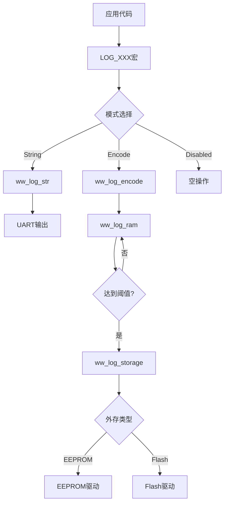

# WW LOG模块完整设计文档

## 文档版本

| 版本 | 日期 | 作者 | 说明 |
|------|------|------|------|
| v2.0 | 2026-01-05 | Kilo Code | 整合Phase1和Phase2的完整设计 |

---

## 目录

1. [系统概述](#1-系统概述)
2. [整体架构](#2-整体架构)
3. [Phase1: 基础日志系统](#3-phase1-基础日志系统)
4. [Phase2: 持久化存储](#4-phase2-持久化存储)
5. [配置系统](#5-配置系统)
6. [API参考](#6-api参考)
7. [使用指南](#7-使用指南)
8. [移植说明](#8-移植说明)

---

## 1. 系统概述

### 1.1 设计目标

WW LOG模块是一个为嵌入式系统设计的高效日志系统，具有以下特点：

- ✅ **多模式支持**：String模式（开发）、Encode模式（生产）、Disabled模式
- ✅ **模块化管理**：支持32个模块，每个模块可独立控制
- ✅ **多级过滤**：编译时过滤 + 运行时过滤
- ✅ **持久化存储**：支持RAM缓冲 + 外存（EEPROM/Flash）
- ✅ **极小开销**：Encode模式下代码占用<5KB
- ✅ **完整仿真**：PC端完整测试环境

### 1.2 系统特性对比

| 特性 | String模式 | Encode模式 | Disabled模式 |
|------|-----------|-----------|-------------|
| 代码占用 | ~50KB | ~5KB | 0 |
| RAM占用 | 大（栈~200B/次） | 小（栈~50B/次） | 0 |
| 可读性 | 直接可读 | 需解析工具 | N/A |
| 执行速度 | 慢(~150μs) | 快(~15μs) | 0 |
| 持久化 | 不支持 | 支持 | N/A |
| 适用场景 | 开发调试 | 生产环境 | 发布版本 |

---

## 2. 整体架构

### 2.1 系统分层架构

```
┌─────────────────────────────────────────────────┐
│          应用层（LOG宏调用）                      │
├─────────────────────────────────────────────────┤
│          日志接口层（ww_log.h）                   │
│    - 统一宏定义                                   │
│    - 模式选择                                     │
│    - 编译时过滤                                   │
├─────────────────────────────────────────────────┤
│   String模式实现    │    Encode模式实现           │
│   (ww_log_str)     │    (ww_log_encode)         │
├─────────────────────────────────────────────────┤
│          模块管理层（ww_log_modules）│
│    - 动态模块开关                                 │
│    - 运行时级别过滤                               │
├─────────────────────────────────────────────────┤
│          RAM缓冲区层（ww_log_ram）                │
│    - Ring Buffer管理                             │
│    - 4KB空间                                     │
│    - 3KB触发阈值                                 │
├─────────────────────────────────────────────────┤
│          外存抽象层（ww_log_storage）             │
│    - 类型检测（EEPROM/Flash）                    │
│    - 分区表管理                                   │
│    - 统一读写接口                                 │
├─────────────────────────────────────────────────┤
│          硬件驱动层                │
│    EEPROM驱动    │    Flash驱动                  │
└─────────────────────────────────────────────────┘
```

### 2.2 模块关系图



### 2.3 文件组织结构

```
ww_log/
├── include/                    # 头文件
│   ├── ww_log.h               # 主接口（模式选择）
│   ├── ww_log_config.h        # 配置文件
│   ├── ww_log_modules.h       # 模块管理
│   ├── ww_log_str.h           # String模式
│   ├── ww_log_encode.h        # Encode模式
│   ├── ww_log_ram.h           # RAM缓冲区
│   ├── ww_log_storage.h       # 外存抽象层
│   ├── auto_file_ids.h        # 自动生成的文件ID
│   └── type.h                 # 类型定义
│
├── core/                       # 核心实现
│   ├── ww_log_common.c        # 公共函数
│   ├── ww_log_modules.c       # 模块管理实现
│   ├── ww_log_str.c           # String模式实现
│   ├── ww_log_encode.c        # Encode模式实现
│   ├── ww_log_ram.c           # RAM缓冲区实现
│   └── ww_log_storage.c       # 外存抽象层实现
│
├── sim/                        # 仿真模块（PC测试）
│   ├── sim_storage.h          # 仿真存储头文件
│   └── sim_storage.c          # 仿真存储实现
│
├── tools/                      # 工具脚本
│   ├── gen_file_ids.py        # 文件ID生成器
│   └── log_decoder.py         # LOG解码器
│
└── doc/                        # 文档
    ├── LOG模块完整设计文档.md  # 本文档
    ├── Phase2_移植指南.md      # 移植指南
    └── Phase2_实施计划.md      # 实施计划
```

---

## 3. Phase1: 基础日志系统

### 3.1 日志级别定义

```c
#define WW_LOG_LEVEL_ERR  0  /* 错误：系统故障 */
#define WW_LOG_LEVEL_WRN  1  /* 警告：潜在问题 */
#define WW_LOG_LEVEL_INF  2  /* 信息：重要状态 */
#define WW_LOG_LEVEL_DBG  3  /* 调试：详细信息 */
```

**使用指导：**
- **ERR**：系统无法正常工作、数据损坏、硬件故障
- **WRN**：潜在问题但系统仍能工作、资源接近耗尽
- **INF**：重要状态变化、关键流程节点
- **DBG**：详细执行流程、中间变量值

### 3.2 模块管理系统

#### 3.2.1 模块定义

每个模块有唯一ID（0-31），在`log_config.json`中配置：

```json
{
  "modules": {
    "DEMO": {
      "id": 1,
      "enable": true,
      "base_id": 64,
      "description": "Demo module"
    }
  }
}
```

#### 3.2.2 文件ID分配

- 每个模块预留64个文件ID
- File ID = base_id + offset
- 例如：DEMO模块的第一个文件ID = 64 + 0 = 64

#### 3.2.3 动态模块控制

```c
/* 运行时启用/禁用模块 */
ww_log_enable_module(WW_LOG_MODULE_DEMO);
ww_log_disable_module(WW_LOG_MODULE_TEST);

/* 批量控制 */
ww_log_set_module_mask(0xFFFFFFFF);  // 全部启用
ww_log_set_module_mask(0x00000000);  // 全部禁用
```

### 3.3 String模式

#### 3.3.1 特点
- 直接输出可读文本
- 支持printf格式化
- 适合开发调试

#### 3.3.2 输出格式
```
[INF] demo_init.c:42 - Application started
[ERR] drv_i2c.c:128 - I2C timeout, addr=0x50
```

#### 3.3.3 实现要点
```c
void ww_log_str_output(const char *file, int line, U8 level,
                       const char *fmt, ...)
{
    /* 提取短文件名 */
    const char *basename = strrchr(file, '/');
    basename = basename ? basename + 1 : file;

    /* 格式化输出 */
    printf("[%s] %s:%d - ", level_str[level], basename, line);
    va_list args;
    va_start(args, fmt);
    vprintf(fmt, args);
    va_end(args);
    printf("\n");
}
```

### 3.4 Encode模式

#### 3.4.1 编码格式

32位编码格式：
```31                    20 19                8 7       2 1    0
┌──────────────────────┬────────────────────┬─────────┬──────┐
│   LOG_ID (12 bits)   │  LINE (12 bits)    │DATA_LEN │LEVEL │
│      0-4095          │     0-4095         │(6 bits) │(2bit)│
└──────────────────────┴────────────────────┴─────────┴──────┘
```

#### 3.4.2 编码示例

```c
/* 源代码 */
LOG_INF("Temperature: %d", temp);  // Line 42, File ID 64

/* 编码结果 */
0x04002A02  // LOG_ID=64, LINE=42, DATA_LEN=1, LEVEL=2
0x0000001E  // Parameter: temp=30
```

#### 3.4.3 解码工具

```python
# tools/log_decoder.py
def decode_log(encoded):
    log_id = (encoded >> 20) & 0xFFF
    line = (encoded >> 8) & 0xFFF
    data_len = (encoded >> 2) & 0x3F
    level = encoded & 0x3
    return log_id, line, data_len, level
```

---

## 4. Phase2: 持久化存储

### 4.1 RAM缓冲区设计

#### 4.1.1 内存布局

```
DLM_MAINTAIN_LOG区域 (4KB = 4096 bytes)
┌─────────────────────────────────────────────────┐
│ LOG Header (64 bytes)│
│ - magic: 0x574C4F47 ('WLOG')                   │
│ - version: 0x00020000                │
│ - write_index, read_index                      │
│ - total_written, flush_count                   │
│ - checksum                                     │
├─────────────────────────────────────────────────┤
│ Ring Buffer Data (4032 bytes)                   │
│ - 可存储约1000条LOG│
│ - 自动翻转处理                                  │
│ - 3KB触发阈值                                   │
└─────────────────────────────────────────────────┘
```

#### 4.1.2 Ring Buffer算法

```c
int log_ram_write(U32 encoded, U32 *params, U8 param_count)
{
    U16 required = 4 + param_count * 4;
    /* 检查空间 */
    if (required > available) {
        /* 翻转到开头 */
        header->overflow_flag = 1;
        write_idx = 0;
    }

    /* 写入数据 */
    *(U32*)(data + write_idx) = encoded;
    write_idx += 4;
    for (i = 0; i < param_count; i++) {
        *(U32*)(data + write_idx) = params[i];
        write_idx += 4;
    }

    /* 检查是否需要刷新 */
    if (write_idx >= threshold) {
        return 1;  // 需要刷新
    }
    return 0;
}
```

#### 4.1.3 热重启恢复

```c
void log_ram_init(U8 force_clear)
{
    /* 检查魔数 */
    if (header->magic == LOG_RAM_MAGIC && !force_clear) {
        /* 验证校验和 */
        if (validate_header(header)) {
            /* 保留现有数据 */
            return;
        }
    }

    /* 初始化新的Header */
    init_header(header);
}
```

### 4.2 外存抽象层

#### 4.2.1 外存类型检测

```c
EXT_MEM_TYPE_E log_storage_detect_type(void)
{
    /* 从寄存器读取 */
    return (EXT_MEM_TYPE_E)REG_WW_STUS_SYS_INFO_U.extMemType;

    /* 可能的值：
     * 0 = EXT_MEM_NONE
     * 1 = EXT_MEM_EEPROM
     * 2 = EXT_MEM_FLASH
     */
}
```

#### 4.2.2 分区表管理

```c
/* 分区表结构 */
typedef struct {
    U32 part_offset;    // 分区起始地址
    U32 part_size;      // 分区大小
    U8  part_type;      // 类型（LOG=5）
    U8  disk_type;      // EEPROM/Flash
} PART_ENTRY_T;

/* 获取LOG分区 */
PART_ENTRY_T* log_storage_get_log_partition(void)
{
    PART_TABLE_T *pt = pt_info_read();
    return pt_entry_get_by_key(pt, PART_ENTRY_TYPE_LOG, 0, 0);
}
```

#### 4.2.3 统一读写接口

```c
/* 写入（自动适配EEPROM/Flash） */
int log_storage_write(U32 offset, const U8 *data, U32 size)
{
    U32 abs_offset = partition->part_offset + offset;

    if (type == EXT_MEM_EEPROM) {
        return svc_eeprom_acc_write(abs_offset, data, size);
    } else if (type == EXT_MEM_FLASH) {
        /* Flash会自动擦除 */
        return svc_flash_acc_write(abs_offset, data, size);
    }
    return -1;
}

/* 读取 */
int log_storage_read(U32 offset, U8 *data, U32 size)
{
    U32 abs_offset = partition->part_offset + offset;

    if (type == EXT_MEM_EEPROM) {
        return svc_eeprom_acc_read(abs_offset, data, size);
    } else if (type == EXT_MEM_FLASH) {
        return svc_flash_acc_read(abs_offset, data, size);
    }
    return -1;
}
```

### 4.3 LOG块格式

#### 4.3.1 块表头结构

```c
typedef struct {
    U32 magic;// 0x4C4F4748 ('LOGH')
    U32 sequence;       // 序列号（递增）
    U32 timestamp;      // 时间戳
    U16 data_size;      // 数据大小
    U16 entry_count;    // LOG条目数
    U8  ram_overflow;   // RAM溢出标志
    U8  reserved[11];   // 保留U32 checksum;       // 校验和
} LOG_BLOCK_HEADER_T;  // 32 bytes
```

#### 4.3.2 外存布局

```
LOG分区 (4KB)
┌─────────────────────────────────────────┐
│ Block Header (32B)                      │
├─────────────────────────────────────────┤
│ LOG Data (up to 4064B)                  │
│ - 多条编码LOG                │
│ - 每条：4B header + N*4B params        │
└─────────────────────────────────────────┘

循环覆盖策略：
- 使用sequence识别最新块
- 写满后从头覆盖
```

### 4.4 刷新机制

#### 4.4.1 触发条件

1. **自动触发**：RAM使用量 >= 3KB
2. **手动触发**：调用`log_manual_flush()`

#### 4.4.2 刷新流程

```c
int log_flush_to_storage(void)
{
    /* 1. 读取RAM数据 */
    U8 buffer[4096];
    U16 size;
    log_ram_read(buffer, sizeof(buffer), &size);

    /* 2. 构建块表头 */
    LOG_BLOCK_HEADER_T header;
    header.magic = 0x4C4F4748;
    header.sequence = get_next_sequence();
    header.data_size = size;
    header.entry_count = count_entries(buffer, size);
    header.checksum = calc_checksum(&header);

    /* 3. 写入外存 */
    log_storage_write(0, (U8*)&header, sizeof(header));
    log_storage_write(sizeof(header), buffer, size);

    /* 4. 清理RAM */
    log_ram_clear_flushed(size);

    return 0;
}
```

---

## 5. 配置系统

### 5.1 编译时配置

**在`ww_log.h`中选择模式：**
```c
/* 选择一个模式 */
#define WW_LOG_MODE_STR      // String模式
// #define WW_LOG_MODE_ENCODE // Encode模式
// #define WW_LOG_MODE_DISABLED // 禁用
```

**在`ww_log_config.h`中配置参数：**
```c
/* 仿真模式开关 */
#define SIMULATION_MODE      // PC测试时启用

/* RAM配置 */
#define LOG_RAM_FLUSH_THRESHOLD  3008  // 3KB

/* 外存配置 */
#define LOG_STORAGE_PARTITION_SIZE  4096
#define LOG_STORAGE_WRITE_RETRY     3

/* 调试选项 */
#define LOG_RAM_STATISTICS   // 启用统计
// #define LOG_DEBUG_VERBOSE // 详细调试输出
```

### 5.2 运行时配置

```c
/* 动态级别控制 */
ww_log_set_level_threshold(WW_LOG_LEVEL_WRN);

/* 动态模块控制 */
ww_log_enable_module(WW_LOG_MODULE_DEMO);
ww_log_disable_module(WW_LOG_MODULE_TEST);

/* 批量控制 */
U32 mask = (1 << WW_LOG_MODULE_DEMO) |
           (1 << WW_LOG_MODULE_DRIVERS);
ww_log_set_module_mask(mask);
```

### 5.3 模块配置文件

**log_config.json：**
```json
{
  "modules": {
    "DEMO": {
      "id": 1,
      "enable": true,
      "base_id": 64,
      "description": "Demo module"
    }
  },
  "files": {
    "src/demo/demo_init.c": {
      "module": "DEMO",
      "offset": 0,
      "description": "Demo initialization"
    }
  }
}
```

---

## 6. API参考

### 6.1 日志输出API

```c
/* 基本日志宏 */
LOG_ERR(fmt, ...)  // 错误级别
LOG_WRN(fmt, ...)  // 警告级别
LOG_INF(fmt, ...)  // 信息级别
LOG_DBG(fmt, ...)  // 调试级别

/* 使用示例 */
LOG_INF("System started");
LOG_ERR("I2C error: %d", error_code);
LOG_DBG("Value: x=%d, y=%d", x, y);
```

### 6.2 模块管理API

```c
/* 模块控制 */
void ww_log_enable_module(U8 module_id);
void ww_log_disable_module(U8 module_id);
void ww_log_set_module_mask(U32 mask);
U32 ww_log_get_module_mask(void);
U8 ww_log_is_module_enabled(U8 module_id);

/* 级别控制 */
void ww_log_set_level_threshold(U8 level);
U8 ww_log_get_level_threshold(void);
```

### 6.3 RAM缓冲区API

```c
/* 初始化和管理 */
void log_ram_init(U8 force_clear);
int log_ram_write(U32 encoded, U32 *params, U8 param_count);
U8 log_ram_need_flush(void);
U16 log_ram_get_usage(void);
U16 log_ram_get_available(void);

/* 数据操作 */
int log_ram_read(U8 *buffer, U16 max_size, U16 *actual_size);
void log_ram_clear_flushed(U16 size);
void log_ram_clear_all(void);

/* 调试和统计 */
void log_ram_dump_hex(void);
U8 log_ram_validate(void);
#ifdef LOG_RAM_STATISTICS
void log_ram_get_stats(LOG_RAM_STATS_T *stats);
#endif
```

### 6.4 外存API

```c
/* 初始化 */
int log_storage_init(void);
EXT_MEM_TYPE_E log_storage_detect_type(void);

/* 分区管理 */
PART_TABLE_T* log_storage_get_partition_table(void);
PART_ENTRY_T* log_storage_get_log_partition(void);
U8 log_storage_check_partition_valid(PART_TABLE_T *pt);

/* 读写操作 */
int log_storage_write(U32 offset, const U8 *data, U32 size);
int log_storage_read(U32 offset, U8 *data, U32 size);
int log_storage_erase(U32 offset, U32 size);

/* 状态查询 */
EXT_MEM_TYPE_E log_storage_get_current_type(void);
int log_storage_get_partition_info(U32 *offset, U32 *size);
U8 log_storage_is_available(void);
```

---

## 7. 使用指南

### 7.1 快速开始

#### Step 1: 配置模式
```c
// ww_log.h
#define WW_LOG_MODE_ENCODE  // 选择Encode模式
```

#### Step 2: 添加文件到配置
```json
// log_config.json
{
  "files": {
    "src/myapp/myfile.c": {
      "module": "APP",
      "offset": 1
    }
  }
}
```

#### Step 3: 生成文件ID
```bash
python tools/gen_file_ids.py log_config.json --header
```

#### Step 4: 在代码中使用
```c
#include "ww_log.h"

void my_function(void) {
    LOG_INF("Function started");

    int result = do_something();
    if (result < 0) {
        LOG_ERR("Operation failed: %d", result);
    }

    LOG_DBG("Debug info: x=%d", x);
}
```

### 7.2 初始化流程

```c
int main(void) {
    /* 1. 初始化LOG系统 */
    ww_log_init();

    /* 2. 初始化RAM缓冲区（Encode模式） */
    #ifdef WW_LOG_MODE_ENCODE
    log_ram_init(0);  // 0=尝试保留数据

    /* 3. 初始化外存（如果需要持久化） */
    if (log_storage_init() == 0) {
        LOG_INF("Storage initialized");
    }
    #endif

    /* 4. 配置运行时参数 */
    ww_log_set_level_threshold(WW_LOG_LEVEL_INF);
    ww_log_enable_module(WW_LOG_MODULE_APP);

    /* 5. 开始使用 */
    LOG_INF("System ready");

    return 0;
}
```

### 7.3 性能优化建议

#### 7.3.1 减少LOG数量
```c
/* 不好的做法 */
for (int i = 0; i < 1000; i++) {
    LOG_DBG("Processing item %d", i);  // 太频繁！
}

/* 好的做法 */
for (int i = 0; i < 1000; i++) {
    process_item(i);
}
LOG_INF("Processed 1000 items");  // 只记录结果
```

#### 7.3.2 使用合适的级别
```c
/* 开发阶段 */
#define WW_LOG_COMPILE_THRESHOLD  WW_LOG_LEVEL_DBG

/* 生产环境 */
#define WW_LOG_COMPILE_THRESHOLD  WW_LOG_LEVEL_WRN
```

#### 7.3.3 静态禁用不需要的模块
```bash
# Makefile
STATIC_OPTS += -DWW_LOG_STATIC_MODULE_TEST_EN=0
```

---

## 8. 移植说明

### 8.1 移植清单

#### 需要移植的文件 ✅
```
include/
├── ww_log.h
├── ww_log_config.h
├── ww_log_modules.h
├── ww_log_encode.h (Encode模式)
├── ww_log_str.h (String模式)
├── ww_log_ram.h (Phase2)
└── ww_log_storage.h (Phase2)

core/
├── ww_log_common.c
├── ww_log_modules.c
├── ww_log_encode.c (Encode模式)
├── ww_log_str.c (String模式)
├── ww_log_ram.c (Phase2)
└── ww_log_storage.c (Phase2)
```

#### 不需要移植的文件 ❌
```
sim/          # 仿真模块
src/test/     # 测试代码
tools/        # 工具脚本
```

### 8.2 移植步骤

#### Step 1: 复制文件
```bash
cp -r include/*.h target_project/log/include/
cp -r core/*.c target_project/log/src/
```

#### Step 2: 修改配置
```c
// ww_log_config.h
// 关闭仿真模式
// #define SIMULATION_MODE

// 定义实际硬件地址
#define DLM_MAINTAIN_LOG_BASE_ADDR  0x20001000
#define DLM_MAINTAIN_LOG_SIZE       4096
```

#### Step 3: 实现硬件接口
```c
// 在实际项目中实现这些函数
PART_TABLE_T* pt_info_read(void);
PART_ENTRY_T* pt_entry_get_by_key(...);
int svc_eeprom_acc_write(...);
int svc_eeprom_acc_read(...);
int svc_flash_acc_write(...);
int svc_flash_acc_read(...);
```

#### Step 4: 集成到构建系统
```makefile
# Makefile
LOG_SRCS = \
    log/src/w
